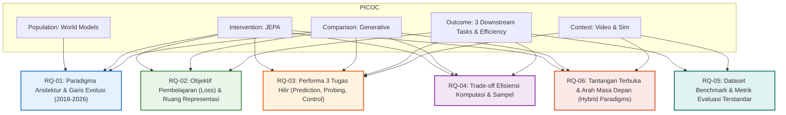

# Protokol Tinjauan Literatur Sistematis (SLR) & Kerangka PICOC

> **Topik Penelitian**: Arsitektur World Model pada Domain Video: Perbandingan Joint Embedding Predictive Architectures (JEPA) dan Generatif  
> **Bidang Kajian**: Kecerdasan Buatan (Artificial Intelligence), Computer Vision, Self-Supervised Learning, Model-Based Reinforcement Learning  
> **Penyusun**:
> 1. **M. Hikari Reiziq Rakhmadinta** (NRP: 5027241079)
> 2. **Arya Bisma Putra Refman** (NRP: 5027241036)
> 3. **Ahmad Syauqi Reza** (NRP: 50027241085)
> 4. **M. Fatihul Qolbi Ash Shidiqi** (NRP: 5027241023)  
> **Institusi**: Institut Teknologi Sepuluh Nopember (ITS)  
> **Status Dokumen**: Disetujui & Terverifikasi (Protokol Resmi SLR)

---

## 1. Latar Belakang & Motivasi Penelitian

World model (model dunia) merupakan salah satu fondasi paling krusial dalam evolusi kecerdasan buatan menuju sistem otonom (*autonomous machine intelligence*). Secara konseptual, world model memungkinkan agen buatan untuk membangun representasi internal mengenai bagaimana lingkungan bekerja, memprediksi kelanjutan adegan di masa depan (*future state prediction*), serta melakukan simulasi dan perencanaan tindakan (*action-conditioned planning*) tanpa harus berinteraksi langsung secara berisiko dengan dunia fisik.

Pada domain video dan data visual berurutan, riset world model terbelah menjadi dua paradigma arsitektural utama yang bersaing secara fundamental:

1. **Garis Keturunan Generatif (Pixel-Space / Generative World Models)**:
   - Menggunakan pendekatan rekonstruksi eksplisit atau pemodelan probabilitas distribusi piksel (variational autoencoders, autoregressive transformers, recurrent state-space models / RSSM, dan video diffusion models).
   - Menghasilkan visualisasi masa depan frame-demi-frame secara fotorealistik.
   - **Tantangan Utama**: Biaya komputasi masif (*computational intractability*), kebutuhan memori raksasa, latensi inferensi tinggi karena proses denoising berulang, serta alokasi kapasitas representasi yang terbuang untuk memprediksi derau piksel yang tidak dapat diprediksi secara deterministik (*task-irrelevant stochastic noise*, seperti gemerisik daun atau riak air).

2. **Garis Keturunan Joint Embedding Predictive Architecture (JEPA / Latent-Space World Models)**:
   - Dipelopori oleh visi Yann LeCun (2022) dan diwujudkan melalui I-JEPA (2023), V-JEPA (2024), MC-JEPA, serta LeWM (2025/2026).
   - Membuang proses dekoding piksel dan memprediksi masa depan secara langsung pada **ruang representasi laten terabstraksi** (*abstract latent embedding space*).
   - Mengeliminasi representasi detail irelevan dan memfokuskan model pada konsistensi semantik, hukum fisika objek, dan dinamika esensial adegan.
   - **Tantangan Utama**: Menjaga stabilitas pembelajaran agar tidak runtuh (*representation collapse*) tanpa fungsi loss kontrasif negatif yang mahal, serta keterbatasan bahwa representasi laten tidak dapat divisualisasikan kembali menjadi video kasat mata secara langsung tanpa decoder tambahan.

Tinjauan literatur sistematis (*Systematic Literature Review* - SLR) ini disusun untuk menginvestigasi secara komparatif, kritis, dan berbasis bukti empiris mengenai keunggulan, kelemahan, kompromi komputasional, efisiensi sampel, serta efektivitas kedua garis keturunan tersebut pada tiga tugas hilir (*downstream tasks*) esensial: **video/frame prediction**, **representation probing**, dan **planning/control**.

---

## 2. Kerangka PICOC (Population, Intervention, Comparison, Outcome, Context)

Kerangka PICOC digunakan untuk menerjemahkan rumusan masalah riset ke dalam konsep-konsep yang terdefinisi secara presisi, terukur, dan dapat ditelusuri:

| Elemen | Definisi Konseptual | Definisi Operasional dalam Studi Ini | Contoh Spesifik / Batasan |
|:---|:---|:---|:---|
| **P – Population** | Siapa / apa entitas yang diteliti? | Sistem kecerdasan buatan (*AI systems*) yang mengimplementasikan **world model** untuk pemodelan dinamika lingkungan, simulasi, dan prediksi kelanjutan adegan pada data visual/video. | Model yang memetakan status saat ini ($s_t$) dan aksi ($a_t$) ke status masa depan ($s_{t+1}$ atau representasi laten $z_{t+1}$). |
| **I – Intervention** | Pendekatan, teknologi, atau arsitektur utama yang diinvestigasi | Arsitektur world model berbasis **Joint Embedding Predictive Architecture (JEPA)** yang bekerja murni pada ruang representasi laten non-generatif. | I-JEPA, V-JEPA, MC-JEPA, LeWM, ACT-JEPA, TD-JEPA, H-JEPA (Hierarchical JEPA). |
| **C – Comparison** | Pendekatan pembanding / baseline alternatif | Arsitektur world model **generatif** berbasis rekonstruksi piksel, autoregresif, atau model difusi. | Ha & Schmidhuber World Models, Dreamer (V1, V2, V3), Video Diffusion Models (VDM, Sora-like, GAIA-1, UniWorld, World4RL, MaskGWM). |
| **O – Outcome** | Hasil, efek, atau performa yang diukur | 1. **Efisiensi Komputasi & Memori**: FLOPs per langkah waktu, parameter size, throughput inferensi, latensi rollout. 2. **Efisiensi Sampel**: Jumlah frame/interaksi yang dibutuhkan untuk konvergensi. 3. **Stabilitas Representasi**: Ketahanan terhadap representasi kolaps dan kebal terhadap *task-irrelevant noise*. 4. **Performa 3 Tugas Hilir (Downstream Tasks)**: &nbsp;&nbsp;a. *Video/Frame Prediction* (FVD, PSNR, SSIM, LPIPS). &nbsp;&nbsp;b. *Representation Probing* (Akurasi linear probing/fine-tuning pada aksi dan klasifikasi video). &nbsp;&nbsp;c. *Planning & Control* (Kumulatif reward, success rate pada simulasi digital/MBRL). | Metrik kuantitatif terstandar di komunitas machine learning dan robotika simulasi. |
| **C – Context** | Lingkungan atau domain penerapan | Domain video dan simulasi interaktif digital tanpa ketergantungan perangkat keras robotik fisik. | Benchmark video terstandar (Kinetics-400, Something-Something v2, ImageNet, nuScenes) dan simulasi perangkat lunak (MuJoCo, DeepMind Control Suite, CARLA, Atari, Minecraft). |

---

## 3. Formulasi Pertanyaan Penelitian (Research Questions - RQs)

Berdasarkan kerangka PICOC, dirumuskan enam pertanyaan penelitian utama (*Research Questions*):

### Rincian Pertanyaan Penelitian:

* **RQ-01: Paradigma Arsitektural & Garis Evolusi**  
  *Pertanyaan*: Apa saja paradigma arsitektural utama pada garis keturunan JEPA dan garis keturunan generatif dalam pemodelan dunia (*world modeling*), dan bagaimana evolusinya sejak 2018 hingga saat ini?  
  *Pemetaan PICOC*: Population, Intervention, Comparison  
  *Fokus Analisis*: Transisi dari autoencoder konvolusional (2018), Recurrent State Space Models (Dreamer, 2019–2023), kemunculan paradigma JEPA (2022–2024), hingga konvergensi model difusi video dan arsitektur laten hierarkis (2024–2026).

* **RQ-02: Objektif Pembelajaran & Ruang Representasi**  
  *Pertanyaan*: Apa perbedaan mendasar dalam fungsi objektif pembelajaran (*loss functions*) dan strategi representasi antara world model berbasis JEPA (prediksi laten) dan generatif (prediksi piksel)?  
  *Pemetaan PICOC*: Intervention, Comparison, Outcome  
  *Fokus Analisis*: Perbedaan matematis antara loss prediksi representasi laten (L1/Smooth L1, InfoNCE, VICReg regularizer, EMA target encoder) versus loss rekonstruksi piksel (MSE, ELBO pada VAE, conditional flow matching, score-based denoising loss pada Diffusion).

* **RQ-03: Performa pada Tugas Hilir (Downstream Tasks)**  
  *Pertanyaan*: Bagaimana perbandingan performa masing-masing garis keturunan pada tugas prediksi sekuens video (*video prediction*), probing representasi visual/aksi (*representation probing*), dan perencanaan/kontrol simulasi (*model-based RL planning*)?  
  *Pemetaan PICOC*: Intervention, Comparison, Outcome, Context  
  *Fokus Analisis*: Bukti empiris pada metrik visual fidelity (FVD, PSNR), klasifikasi aksi tanpa fine-tuning encoder (linear probing top-1), serta kumulatif reward dan efisiensi horizon perencanaan pada algoritma kontrol berbasis model (MPC/CEM).

* **RQ-04: Trade-off Efisiensi Komputasi & Efisiensi Sampel**  
  *Pertanyaan*: Bagaimana trade-off efisiensi komputasi (FLOPs, memori VRAM, latensi inferensi) dan efisiensi sampel antara world model berbasis JEPA dan world model generatif?  
  *Pemetaan PICOC*: Intervention, Comparison, Outcome  
  *Fokus Analisis*: Analisis biaya komputasi training dan inferensi. Mengapa JEPA menghemat komputasi saat planning (tidak memerlukan decoding video), dan bagaimana kebutuhan jumlah data interaksi/frame dari kedua pendekatan.

* **RQ-05: Dataset Benchmark & Metrik Evaluasi**  
  *Pertanyaan*: Apa dataset benchmark dan metrik evaluasi yang umum digunakan komunitas riset untuk mengukur kualitas world model pada kedua pendekatan tersebut?  
  *Pemetaan PICOC*: Outcome, Context  
  *Fokus Analisis*: Taksonomi lingkungan simulasi (MuJoCo, CARLA, Atari, Minecraft) dan dataset video (Kinetics, SSv2, nuScenes), beserta metrik evaluasi representasi, persepsi, dan kebijakan kontrol.

* **RQ-06: Tantangan Terbuka & Arah Masa Depan**  
  *Pertanyaan*: Apa tantangan terbuka dan arah penelitian masa depan dalam menggabungkan atau memilih antara kedua garis keturunan tersebut dalam pengembangan world model?  
  *Pemetaan PICOC*: Intervention, Comparison, Context  
  *Fokus Analisis*: Batasan intrinsik (misal: halusinasi generative vs keterbatasan visualisasi JEPA), arsitektur hibrida (JEPA latent backbone + on-demand generative head), integrasi multimodal vision-language-action (VLA), dan stabilitas perencanaan jangka panjang (*long-horizon predictive planning*).

---

## 4. Kriteria Kelayakan (Eligibility Criteria)

### 4.1 Kriteria Inklusi (Inclusion Criteria - IC)

| Kode | Kriteria Inklusi | Rasional & Ambang Batas Evaluasi | Wajib? |
|:---:|:---|:---|:---:|
| **IC1** | Artikel secara langsung mengusulkan, mengevaluasi, menganalisis, atau membandingkan arsitektur world model (berbasis JEPA maupun generatif). | Menjamin relevansi topik inti dengan arsitektur pemodelan dunia. | **Wajib** |
| **IC2** | Domain aplikasi berkaitan dengan data video, sekuens observasi visual, atau interaksi simulasi digital berurutan. | Menolak studi yang murni teks tanpa komponen pemodelan temporal visual. | **Wajib** |
| **IC3** | Diterbitkan dalam rentang waktu **Januari 2018 hingga September 2026**. | Menangkap era modern world model sejak terbitnya seminal paper Ha & Schmidhuber (2018). | **Wajib** |
| **IC4** | Diterbitkan oleh laboratorium riset bereputasi tinggi (Meta AI/FAIR, DeepMind, OpenAI, dsb.) atau jurnal bereputasi tinggi terindeks Scopus/WoS. | Berfungsi sebagai penguat prioritas kualitas (*quality booster*) saat QA. | *Opsional/Prioritas* |
| **IC5** | Teks lengkap (*full text*) tersedia dan ditulis dalam bahasa Inggris. | Memastikan kelayakan ekstraksi data ilmiah secara mendalam dan valid. | **Wajib** |

### 4.2 Kriteria Eksklusi (Exclusion Criteria - EC)

| Kode | Kriteria Eksklusi | Alasan Penolakan |
|:---:|:---|:---|
| **EC1** | Artikel duplikat yang muncul di lebih dari satu basis data akademik. | Menghindari perhitungan ganda (*double counting*). |
| **EC2** | Diterbitkan di luar rentang waktu (sebelum 2018 atau setelah September 2026). | Tidak relevan dengan fokus perkembangan era kontemporer. |
| **EC3** | Tidak membahas arsitektur world model atau tidak relevan dengan perbandingan JEPA vs generatif (misal: murni computer vision statis tanpa dinamika temporal). | Di luar ruang lingkup penelitian (*out of scope*). |
| **EC4** | Tidak melibatkan prediksi dinamika lingkungan/dunia (misal: murni klasifikasi gambar tunggal, LLM murni tanpa world grounding). | Tidak memenuhi esensi definisi *world model*. |
| **EC5** | Bukan artikel ilmiah lengkap (hanya abstrak pendek, editorial, poster satu halaman, atau slide presentasi). | Kurang detail metodologis untuk ekstraksi data. |
| **EC6** | Teks lengkap (*full-text*) tidak dapat diakses (*behind paywall* tanpa akses institusional / tautan rusak). | Data tidak dapat diverifikasi secara objektif. |
| **EC7** | Publikasi non-peer-reviewed yang tidak memiliki kredibilitas teknis memadai atau laporan opini informal. | Mempertahankan standar mutu akademik tinjauan sistematis. |

---

## 5. Ambang Batas Kualitas (Quality Assessment Threshold)

Setiap artikel yang lolos tahap penyaringan teks lengkap dinilai menggunakan 8 instrumen kriteria mutu (**QA1 s/d QA8**) dengan skala skor 1.0 (Rendah), 2.0 (Sedang), dan 3.0 (Tinggi) — total skor maksimal 24.0 poin:

$$\text{QA Percentage} = \left( \frac{\sum_{i=1}^{8} \text{QA}_i}{24.0} \right) \times 100\%$$

- **Kategori Final (Diterima)**: Skor $\ge 75.0\%$ ($\ge 18$ poin) $\rightarrow$ Dimasukkan ke dalam sintesis akhir.
- **Kategori Review (Perlu Pertimbangan Khusus)**: Skor $60.0\% - 74.9\%$ ($14.4 - 17.9$ poin) $\rightarrow$ Ditinjau ulang oleh kedua reviewer.
- **Kategori Exclude (Ditolak)**: Skor $< 60.0\%$ ($< 14.4$ poin) $\rightarrow$ Dikeluarkan dari sintesis akhir karena bukti tidak memadai.

---
*Dokumen ini merupakan pedoman resmi peninjauan pustaka dan telah diverifikasi oleh tim peneliti.*
