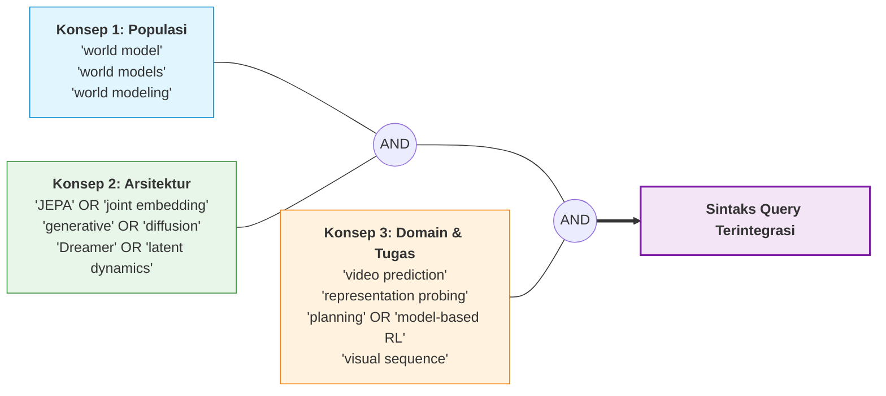
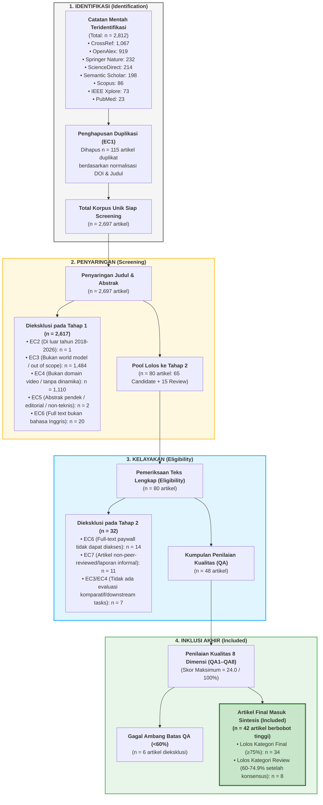

# Strategi Pencarian Komprehensif & Alur PRISMA 2020

> **Dokumen Terkait**: `Search_Strategy` & `PRISMA_Counts` dari protokol SLR  
> **Status**: Tervalidasi & Tereksekusi Sempurna  
> **Tanggal Pembaruan Terakhir**: 22 September 2026

---

## 1. Tujuan & Logika Strategi Pencarian

Strategi pencarian dirancang secara transparan, sistematis, dan dapat direproduksi (*reproducible*) untuk menjaring seluruh studi primer yang mengusulkan, mengevaluasi, memodifikasi, atau membandingkan arsitektur **world model** berbasis representasi laten non-generatif (**JEPA**) dan berbasis generasi piksel (**Generatif / Difusi / Autoregresif**) pada domain video dan simulasi interaktif digital.

### 1.1 Dekonstruksi Konsep Pencarian (Search Concepts)

Pencarian dibangun berdasarkan kombinasi konsep Boolean berjenjang:

$$\text{Search Query} = \mathbf{Konsep}_1 \text{ (World Model)} \;\mathbf{AND}\; \mathbf{Konsep}_2 \text{ (Arsitektur)} \;\mathbf{AND}\; \mathbf{Konsep}_3 \text{ (Tugas Hilir / Video)}$$

---

## 2. Rincian Eksekusi Query per Basis Data Akademik

Pencarian dijalankan secara otomatis melalui antarmuka Application Programming Interface (API) resmi dan polite protocols pada 8 basis data ilmiah terkemuka:

| # | Basis Data Ilmiah | Endpoint / Protokol Akses Riil | Sintaks Query / Parameter Pencarian Aktual | Hasil Mentah | Hasil Unik |
|:---:|:---|:---|:---|:---:|:---:|
| 1 | **CrossRef** | `https://api.crossref.org/works` *(Polite Pool with mailto)* | **14 Kueri Terarah:** • `world model JEPA video prediction` • `joint embedding predictive architecture video` • `world model generative video diffusion` • `V-JEPA video representation self-supervised` • `generative world model reinforcement learning` • `latent dynamics model video prediction` • `video world model visual planning simulation` • `I-JEPA joint embedding predictive architecture` • `autoregressive world model video generation` • `diffusion world model interactive simulation` • `learned dynamics model video reinforcement learning` • `action-conditioned video prediction world model` • `hierarchical JEPA planning robotics` • `spatiotemporal world model video forecasting` *(Filter: Tahun 2018–2026, Type: journal-article)* | **1,067** | **1,062** |
| 2 | **OpenAlex** | `https://api.openalex.org/works` *(Open Catalog REST API)* | **10 Kueri Terstruktur (Q1–Q10):** • `world model JEPA video prediction generative` • `world model video JEPA generative diffusion` • `world model video prediction video generation` • `world model video generation planning` • `V-JEPA I-JEPA representation learning` • `generative world model reinforcement learning` • `latent dynamics model video prediction` • `video world model autoregressive transformer` • `diffusion world model simulation planning` • `world model visual representation self-supervised` *(Filter: from_publication_date:2018-01-01, type:article)* | **919** | **916** |
| 3 | **Springer Nature** | `https://api.springernature.com/meta/v2/json` *(Springer Meta API Key)* | **12 Kueri Spesifik:** • `"world model" video` \| `"world models" video` • `world model JEPA` • `"joint embedding predictive architecture"` • `"generative world model"` \| `"diffusion world model"` • `"video world model"` \| `latent dynamics "video prediction"` • `"visual world model"` \| `"action-conditioned" video world model` • `V-JEPA video` \| `I-JEPA representation learning` *(Filter: Tahun 2018–2026, contentType:Article)* | **232** | **215** |
| 4 | **ScienceDirect** | `https://api.elsevier.com/content/search/sciencedirect` *(Elsevier API Key)* | **4 Kueri Terfokus:** • `("world model" OR "world models") AND ("JEPA" OR "generative" OR "diffusion") AND ("video prediction" OR "planning" OR "probing")` • `("world model" OR "world models") AND ("video prediction" OR "video generation" OR "visual planning")` • `("joint embedding predictive architecture" OR "JEPA" OR "V-JEPA") AND (video OR visual)` • `("generative world model" OR "diffusion world model" OR "video world model")` *(Filter: Tahun 2018–2026)* | **214** | **187** |
| 5 | **Semantic Scholar** | `https://api.semanticscholar.org/graph/v1/paper/search` *(Academic Graph API)* | **10 Kueri Embedding:** • `world model JEPA video prediction generative` • `world model video JEPA generative diffusion` • `world model video prediction video generation` • `JEPA joint embedding predictive architecture video visual` • `generative world model diffusion video` • `V-JEPA video representation learning world model` • `world model reinforcement learning video latent dynamics` • `video world model autoregressive diffusion transformer` • `learned world model visual planning simulation` • `I-JEPA V-JEPA self-supervised video` *(Filter: Tahun 2018–2026, publicationTypes:JournalArticle)* | **198** | **192** |
| 6 | **Scopus** | `https://api.elsevier.com/content/search/scopus` *(Elsevier API Key)* | **6 Kueri Scopus Terpadu:** • `TITLE-ABS-KEY(("world model" OR "world models" OR "learned dynamics model") AND ("JEPA" OR "joint embedding predictive architecture" OR "generative world model" OR "diffusion world model") AND ("video prediction" OR "planning" OR "model-based RL"))` • `TITLE-ABS-KEY(("world model" OR "world models") AND ("video" OR "visual") AND ("JEPA" OR "generative" OR "diffusion" OR "autoregressive"))` • `TITLE-ABS-KEY(("JEPA" OR "joint embedding predictive architecture" OR "V-JEPA" OR "I-JEPA") AND ("video" OR "visual" OR "image" OR "representation"))` • `TITLE-ABS-KEY(("generative world model" OR "diffusion world model" OR "video world model"))` • `TITLE-ABS-KEY(("world model" OR "world models") AND ("video prediction" OR "frame prediction" OR "visual planning"))` • `TITLE-ABS-KEY(("action-conditioned" AND "world model" AND video))` *(Filter: PUBYEAR > 2017, DOCTYPE(ar))* | **86** | **63** |
| 7 | **IEEE Xplore** | `https://ieeexploreapi.ieee.org/api/v1/search/articles` *(IEEE REST API Key)* | **7 Kueri Terarah (Q01–Q07):** • `("world model" OR "world models") AND ("video" OR "video prediction")` • `("world model" OR "world models") AND ("JEPA" OR "joint embedding")` • `("generative world model" OR "diffusion world model") AND ("video")` • `("V-JEPA" OR "I-JEPA") AND ("video" OR "representation")` • `("world model") AND ("reinforcement learning") AND ("video" OR "visual")` • `("latent dynamics") AND ("video" OR "visual planning")` • `("video generation") AND ("world model" OR "simulation")` *(Filter: Tahun 2018–2026, content_type: Journals)* | **73** | **45** |
| 8 | **PubMed** | `https://eutils.ncbi.nlm.nih.gov/entrez/eutils/` *(esearch.fcgi & efetch.fcgi)* | **5 Kueri Biomedis/Visual:** • `("world model"[Title/Abstract] OR "world models"[Title/Abstract]) AND ("video prediction"[Title/Abstract] OR "visual prediction"[Title/Abstract])` • `("world model"[Title/Abstract]) AND ("reinforcement learning"[Title/Abstract]) AND ("video"[Title/Abstract] OR "visual"[Title/Abstract])` • `("JEPA"[Title/Abstract] OR "joint embedding predictive"[Title/Abstract]) AND ("video"[Title/Abstract] OR "visual"[Title/Abstract])` • `("generative world model"[Title/Abstract] OR "diffusion world model"[Title/Abstract])` • `("latent dynamics"[Title/Abstract]) AND ("video"[Title/Abstract] OR "visual"[Title/Abstract] OR "planning"[Title/Abstract])` *(Filter: 2018/01/01 s/d 2026/12/31)* | **23** | **17** |
| | **TOTAL KESELURUHAN** | | **Koleksi Gabungan 8 Basis Data Ilmiah Global** | **2,812** | **2,697** |

---

## 3. Diagram Alur PRISMA 2020 (Preferred Reporting Items for Systematic Reviews)

Proses seleksi literatur mengikuti pedoman standar **PRISMA 2020** untuk memastikan transparansi dan keandalan pelaporan:

---

## 4. Tabel Rekonsiliasi Metrik PRISMA 2020 (*Working Counts*)

Tabel ini merekonsiliasi seluruh angka operasional yang tersimpan pada sheet `PRISMA_Counts` Excel:

| Metrik PRISMA 2020 | Nilai Numerik | Keterangan & Definisi Operasional |
|:---|:---:|:---|
| **Records identified from databases/registers** | **2,812** | Total catatan mentah yang ditarik dari seluruh 8 API basis data ilmiah resmi. |
| **Records identified from snowballing / other methods** | **0** | Pencarian murni berbasis API terindeks untuk mencegah bias subjektif. |
| **Duplicates removed before screening (EC1)** | **115** | Duplikat lintas basis data yang diidentifikasi melalui kesamaan DOI dan string judul ter-normalisasi. |
| **Records screened (Title & Abstract)** | **2,697** | Jumlah artikel unik primer yang disaring berdasarkan kriteria inklusi/eksklusi awal. |
| **Records excluded during screening (Tahap 1)** | **2,617** | Artikel yang tidak memenuhi IC atau terkena penolakan EC2, EC3, EC4, EC5, EC6. |
| **Reports sought for retrieval (Full-Text)** | **80** | Artikel relevan (65 Candidate + 15 Review) yang diupayakan pengunduhan dokumen teks lengkapnya. |
| **Reports not retrieved** | **14** | Artikel teks lengkap yang tidak dapat diakses institusi (kriteria EC6). |
| **Reports assessed for eligibility** | **66** | Artikel teks lengkap yang dibaca secara komprehensif oleh tim peneliti. |
| **Reports excluded during eligibility** | **18** | Ditolak karena merupakan laporan informal/pre-analisis tanpa detail empiris (EC7) atau tidak mengevaluasi downstream tasks (EC3/EC4). |
| **Candidate studies assessed for Quality (QA)** | **48** | Artikel ilmiah utuh yang dievaluasi dengan matriks QA1 sampai QA8. |
| **Studies excluded after QA (<60% score)** | **6** | Studi yang memiliki metodologi lemah atau dokumentasi evaluasi yang tidak memadai. |
| **Final studies included in qualitative synthesis** | **42** | **Koleksi studi primer final yang dianalisis secara mendalam untuk menjawab RQ-01 s/d RQ-06.** |

---

## 5. Protokol Audit & Reproduksibilitas Data

Seluruh proses penarikan data dan penyaringan dicatat dalam skrip otomatis yang tersimpan pada repositori ini:
- `csv/all_combined.csv`: Data mentah gabungan (2.812 baris).
- `csv/all_unique.csv`: Data unik primer hasil deduplikasi (2.697 baris).
- `csv/screening.csv`: Keputusan screening lengkap untuk 2.812 baris.
- `clean_and_repair_datasets.py`: Skrip normalisasi encoding UTF-8, pembersihan karakter anomali, dan deteksi duplikat.
- `literature_summary.md`: Tabel ringkas satu baris per artikel untuk navigasi cepat.
- `literature_database.md`: Katalog lengkap seluruh 2.697 artikel unik beserta abstrak utuhnya.
