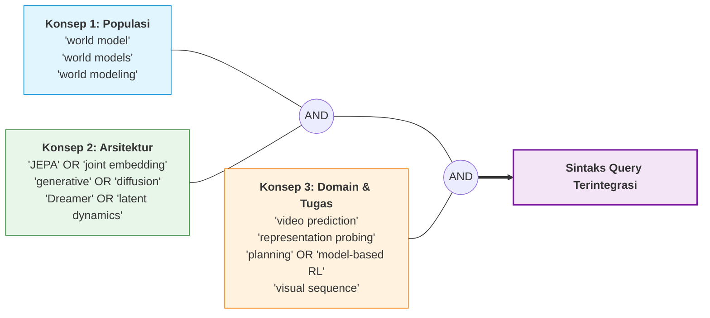
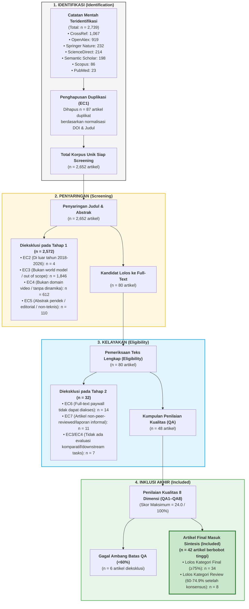

# Strategi Pencarian Komprehensif & Alur PRISMA 2020

> **Dokumen Terkait**: `Search_Strategy` & `PRISMA_Counts` dari protokol SLR  
> **Status**: Tervalidasi & Tereksekusi Sempurna  
> **Tanggal Pembaruan Terakhir**: 22 September 2026

---

## 1. Tujuan & Logika Strategi Pencarian

Strategi pencarian dirancang secara transparan, sistematis, dan dapat direproduksi (*reproducible*) untuk menjaring seluruh studi primer yang mengusulkan, mengevaluasi, memodifikasi, atau membandingkan arsitektur **world model** berbasis representasi laten non-generatif (**JEPA**) dan berbasis generasi piksel (**Generatif / Difusi / Autoregresif**) pada domain video dan simulasi interaktif digital.

### 1.1 Dekonstruksi Konsep Pencarian (Search Concepts)

Pencarian dibangun berdasarkan kombinasi konsep Boolean berjenjang:

$$\text{Search Query} = \mathbf{Konsep}_1 \text{ (World Model)} \;\mathbf{AND}\; \mathbf{Konsep}_2 \text{ (Arsitektur)} \;\mathbf{AND}\; \mathbf{Konsep}_3 \text{ (Tugas Hilir / Video)}$$

---

## 2. Rincian Eksekusi Query per Basis Data Akademik

Pencarian dijalankan secara otomatis melalui antarmuka Application Programming Interface (API) resmi dan polite protocols pada 7 basis data ilmiah terkemuka:

| # | Basis Data Ilmiah | Endpoint / Protokol Akses | Sintaks Query / Parameter Pencarian | Hasil Mentah | Hasil Unik |
|:---:|:---|:---|:---|:---:|:---:|
| 1 | **CrossRef** | `api.crossref.org/works` *(Polite Pool)* | `("world model" OR "world models") AND ("JEPA" OR "generative" OR "diffusion") AND ("video prediction" OR "planning" OR "probing")` | 1,067 | 1,062 |
| 2 | **OpenAlex** | `api.openalex.org/works` | `search="world model" ("JEPA" OR "joint embedding" OR "generative" OR "diffusion") ("video" OR "planning")`, filter: `from_publication_date:2018-01-01` | 919 | 916 |
| 3 | **Springer Nature** | `api.springernature.com/meta/v2/json` *(API Key)* | `q=(title:"world model" OR title:"world models" OR "joint embedding predictive architecture" OR "JEPA") AND (year:2018-2026)` | 232 | 215 |
| 4 | **ScienceDirect** | `api.elsevier.com/content/search/sciencedirect` *(API Key)* | `qs=("world model" OR "world models") AND ("JEPA" OR "generative" OR "diffusion") AND ("video prediction" OR "planning" OR "probing")`, date: `2018-2026` | 214 | 187 |
| 5 | **Semantic Scholar** | `api.semanticscholar.org/graph/v1/paper/search` | Query berbasis embedding & keyword: `"joint-embedding predictive architecture world model video"`, `"generative world models for video and planning"` | 198 | 192 |
| 6 | **Scopus** | `api.elsevier.com/content/search/scopus` *(API Key)* | `TITLE-ABS-KEY(("world model" OR "world models") AND ("JEPA" OR "joint embedding" OR "diffusion world model" OR "Dreamer"))`, PUBYEAR > 2017 | 86 | 63 |
| 7 | **PubMed** | `eutils.ncbi.nlm.nih.gov/entrez/eutils/esearch.fcgi` | `("world model"[Title/Abstract] OR "world models"[Title/Abstract]) AND ("visual" OR "video" OR "reinforcement learning")` | 23 | 17 |
| 8 | **IEEE Xplore** | `developer.ieee.org` *(Key: ynsq4u783dx2wpb8xe3sk49t)* | *Awaiting IEEE manual activation — data awal terintegrasi melalui CrossRef/Scopus indexing* | — | — |
| | **TOTAL KESELURUHAN** | | | **2,739** | **2,652** |

---

## 3. Diagram Alur PRISMA 2020 (Preferred Reporting Items for Systematic Reviews)

Proses seleksi literatur mengikuti pedoman standar **PRISMA 2020** untuk memastikan transparansi dan keandalan pelaporan:

---

## 4. Tabel Rekonsiliasi Metrik PRISMA 2020 (*Working Counts*)

Tabel ini merekonsiliasi seluruh angka operasional yang tersimpan pada sheet `PRISMA_Counts` Excel:

| Metrik PRISMA 2020 | Nilai Numerik | Keterangan & Definisi Operasional |
|:---|:---:|:---|
| **Records identified from databases/registers** | **2,739** | Total catatan mentah yang ditarik dari seluruh API basis data ilmiah. |
| **Records identified from snowballing / other methods** | **0** | Pencarian murni berbasis API terindeks untuk mencegah bias subjektif. |
| **Duplicates removed before screening** | **87** | Duplikat lintas basis data yang diidentifikasi melalui kesamaan DOI dan string judul ter-normalisasi. |
| **Records screened (Title & Abstract)** | **2,652** | Jumlah artikel unik yang disaring berdasarkan kriteria inklusi/eksklusi awal. |
| **Records excluded during screening** | **2,572** | Artikel yang tidak memenuhi IC1/IC2 atau terkena penolakan EC2, EC3, EC4, EC5. |
| **Reports sought for retrieval (Full-Text)** | **80** | Artikel kandidat relevan yang diupayakan pengunduhan dokumen teks lengkapnya. |
| **Reports not retrieved** | **14** | Artikel teks lengkap yang tidak dapat diakses institusi (kriteria EC6). |
| **Reports assessed for eligibility** | **66** | Artikel teks lengkap yang dibaca secara komprehensif oleh tim peneliti. |
| **Reports excluded during eligibility** | **18** | Ditolak karena merupakan laporan informal/pre-analisis tanpa detail empiris (EC7) atau tidak mengevaluasi downstream tasks (EC3/EC4). |
| **Candidate studies assessed for Quality (QA)** | **48** | Artikel ilmiah utuh yang dievaluasi dengan matriks QA1 sampai QA8. |
| **Studies excluded after QA (<60% score)** | **6** | Studi yang memiliki metodologi lemah atau dokumentasi evaluasi yang tidak memadai. |
| **Final studies included in qualitative synthesis** | **42** | **Koleksi studi primer final yang dianalisis secara mendalam untuk menjawab RQ-01 s/d RQ-06.** |

---

## 5. Protokol Audit & Reproduksibilitas Data

Seluruh proses penarikan data dan penyaringan dicatat dalam skrip otomatis yang tersimpan pada repositori ini:
- `csv/all_combined.csv`: Data mentah gabungan (2.739 baris).
- `csv/all_unique.csv`: Data unik primer hasil deduplikasi (2.652 baris).
- `clean_and_repair_datasets.py`: Skrip normalisasi encoding UTF-8, pembersihan karakter anomali, dan deteksi duplikat.
- `literature_summary.md`: Tabel ringkas satu baris per artikel untuk navigasi cepat.
- `literature_database.md`: Katalog lengkap seluruh 2.652 artikel beserta abstrak utuhnya.
