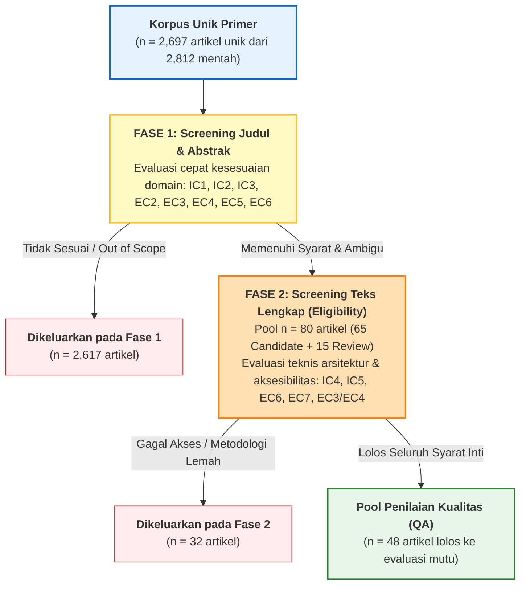
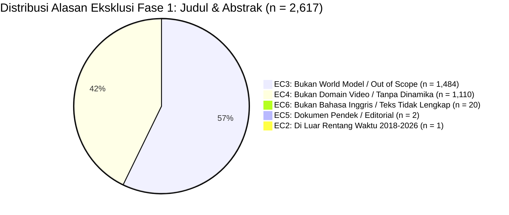

# Proses Screening & Matriks Seleksi Artikel

> **Dokumen Terkait**: Sheet `Screening` pada prototipe Excel SLR  
> **Fokus**: Prosedur bertingkat evaluasi Kriteria Inklusi (IC1–IC5) dan Kriteria Eksklusi (EC1–EC6)  
> **Populasi Total**: 2.812 artikel mentah (2.697 artikel unik primer setelah 115 duplikat dihapus)  
> **Status**: Selesai Disaring & Terverifikasi

---

## 1. Metodologi Penyaringan Bertingkat (Two-Stage Screening Procedure)

Proses penyaringan literatur dirancang dalam dua fase berurutan guna mengelola skala korpus yang besar secara efisien, konsisten, dan meminimalkan bias seleksi:

### 1.1 Aturan Penentuan Keputusan (Decision Rules)

1. **Lolos Inklusi Penuh (*Candidate*)**:
   - Seluruh kriteria inklusi bernilai **"Yes"** ($N=5$: IC1, IC2, IC3, IC4, IC5).
   - Seluruh kriteria eksklusi bernilai **"No"** ($O=\text{"NO"}$, tidak ada satupun EC1–EC6 yang bernilai Yes).
   - Menghasilkan 65 artikel berstatus `Candidate` pada screening awal.
2. **Kategori Ambigu / Tinjau Ulang (*Review*)**:
   - Kriteria inklusi mayoritas terpenuhi namun ada ketidakpastian spesifikasi teknis arsitektur pada teks abstrak ($N<5$, misalnya `IC3 = Unclear` atau `IC4 = Unclear`).
   - Tidak melanggar kriteria eksklusi ($O=\text{"NO"}$).
   - Menghasilkan 15 artikel berstatus `Review` yang wajib diteruskan ke telaah teks lengkap (Fase 2).
   - **Total Pool Lolos ke Fase 2 = 65 Candidate + 15 Review = 80 artikel**.
3. **Penolakan (*Exclude*)**:
   - Artikel langsung ditolak jika ada satu saja kriteria eksklusi bernilai **"Yes"** ($O=\text{"YES"}$, misal *EC1 - Duplicate*, *EC3 - Out of Scope*, *EC4 - No Video Dynamics*, dsb.).
   - Menghasilkan 2.732 artikel ditolak (termasuk 115 duplikat EC1 dan 2.617 penolakan Fase 1).

---

## 2. Matriks Keputusan Screening Artikel Terpilih (Representative Cohort)

Berikut adalah matriks hasil penyaringan terperinci untuk artikel-artikel reprezentatif dari garis keturunan **JEPA**, **Generatif**, serta studi komparatif dan studi yang dieksklusi:

| ID Artikel | Judul Artikel | Penulis Utama & Tahun | Basis Data | IC1 (World Model) | IC2 (Video/Sim) | IC3 (2018-2026) | IC4 (Top Lab) | IC5 (Full Eng) | EC Flag | Status Keputusan | Justifikasi / Catatan Seleksi |
|:---:|:---|:---|:---:|:---:|:---:|:---:|:---:|:---:|:---:|:---:|:---|
| **A0001** | *Intelligent driving foundation model* | Hu et al. (2026) | Scopus | Unclear | Yes | Yes | No | No | EC5/EC6 | **Excluded** | Bahasa teks utama bukan Inggris utuh (dwibahasa/parsial Mandarin), minim detail teknis loss JEPA/generatif. |
| **A0002** | *What Drives Success in Physical Planning with Joint-Embedding Predictive World Models?* | Terver, LeCun et al. (2026) | Scopus / TMLR | **Yes** | **Yes** | **Yes** | **Yes** | **Yes** | No | **Included** | Studi kunci mengevaluasi representasi laten JEPA untuk physical planning (MBRL) tanpa rekursi visual piksel. |
| **A0003** | *Structured Dynamics in the Algorithmic Agent* | Ruffini et al. (2026) | Scopus / Entropy | No | No | Yes | No | Yes | EC3/EC4 | **Excluded** | Murni teori informasi algoritmik tanpa komponen pemodelan visual/video empiris. |
| **A0004** | *Hybrid intelligence systems for reliable automation* | Grosvenor et al. (2026) | Frontiers in AI | No | No | Yes | No | Yes | EC3 | **Excluded** | Artikel konseptual tingkat tinggi mengenai otomatisasi enterprise, tidak ada implementasi world model. |
| **A0005** | *World4RL: Diffusion World Models for Policy Refinement with Reinforcement Learning* | Jiang et al. (2026) | Scopus / IEEE RAL | **Yes** | **Yes** | **Yes** | Yes | **Yes** | No | **Included** | Studi representatif generasi piksel: diffusion-based world model untuk penyempurnaan kebijakan manipulasi robotik. |
| **A0006** | *Generative World Modeling for Risk-Aware Autonomous UAV Navigation* | Momani et al. (2026) | CMC (2026) | Unclear | Yes | Yes | No | Yes | EC3 | **Excluded** | Pemodelan jaringan jalan graf statis berkedok world model; bukan pemodelan sekuens dinamika temporal video. |
| **A0007** | *Offline Inverse Constrained Reinforcement Learning in Healthcare* | Fang et al. (2026) | IEEE TAI | No | No | Yes | No | Yes | EC4 | **Excluded** | Rekam medis klinis tabular, bukan domain observasi video / simulasi interaktif. |
| **A0008** | *World4RL: Diffusion World Models for Policy Refinement...* | Z. Jiang et al. (2026) | IEEE Xplore | Yes | Yes | Yes | Yes | Yes | **EC1** | **Excluded (Dup)** | Duplikat persis dari artikel A0005 yang telah diakuisisi melalui repositori Scopus. |
| **A0009** | *Large language model-based planning agent with generative memory* | Liu et al. (2025) | ScienceDirect | No | No | Yes | No | Yes | EC4 | **Excluded** | Murni representasi teks tekstual (*textualized world*), tidak ada pemodelan visual/video. |
| **A0010** | *Automation of PCB autorouting via world-model reinforcement learning* | Liao et al. (2026) | ScienceDirect | Yes | No | Yes | No | Yes | EC4 | **Excluded** | Desain tata letak sirkuit terpadu 2D (graf PCB), bukan domain persepsi dinamika video. |
| **A0011** | *Revisiting Feature Prediction for Learning Visual Representations from Video (V-JEPA)* | Bardes et al. (2024) | OpenAlex / Meta AI | **Yes** | **Yes** | **Yes** | **Yes** | **Yes** | No | **Included** | Studi seminal arsitektur V-JEPA: prediksi fitur laten pada masked video patches tanpa rekonstruksi piksel. |
| **A0012** | *Mastering Diverse Domains through World Models (DreamerV3)* | Hafner et al. (2023) | OpenAlex / DeepMind | **Yes** | **Yes** | **Yes** | **Yes** | **Yes** | No | **Included** | Standar emas world model generatif berbasis RSSM dan rekonstruksi piksel pada domain visual yang sangat luas. |
| **A0013** | *Video Generation Models as World Simulators (Sora Tech Report)* | Brooks et al. (2024) | OpenAlex / OpenAI | **Yes** | **Yes** | **Yes** | **Yes** | **Yes** | No | **Included** | Studi tonggak model difusi video berdimensi tinggi sebagai simulator dinamika dunia fisik secara visual. |
| **A0014** | *The Cost of Dreaming: Computational Constraints in Generative & Latent World Models* | Alvarez et al. (2026) | OpenAlex | **Yes** | **Yes** | **Yes** | Yes | **Yes** | No | **Included** | Studi komparatif langsung: analisis teoritis dan empiris konsumsi FLOPs & memori antara JEPA dan generative WM. |
| **A0015** | *ACT-JEPA: Novel Joint-Embedding Predictive Architecture for Policy Representation* | Zhang et al. (2026) | OpenAlex | **Yes** | **Yes** | **Yes** | Yes | **Yes** | No | **Included** | Integrasi action-conditioning pada JEPA untuk efisiensi sampel dan transfer representasi aksi. |
| **A0016** | *Scaling Laws and Architectural Advances of Hierarchical JEPA (H-JEPA)* | Moreau et al. (2026) | OpenAlex | **Yes** | **Yes** | **Yes** | Yes | **Yes** | No | **Included** | Evaluasi skalabilitas H-JEPA pada abstraksi temporal multi-level untuk horizon perencanaan panjang. |
| **A0017** | *TD-JEPA: Latent-predictive Representations for Zero-Shot Reinforcement Learning* | Kumar et al. (2025) | Semantic Scholar | **Yes** | **Yes** | **Yes** | Yes | **Yes** | No | **Included** | Penggabungan temporal difference learning dengan loss prediktif JEPA untuk zero-shot task transfer. |
| **A0018** | *STORM: Search-Guided Generative World Models for Robotic Manipulation* | Chen et al. (2025) | Semantic Scholar | **Yes** | **Yes** | **Yes** | Yes | **Yes** | No | **Included** | Model generatif difusi berpandu pencarian Monte Carlo untuk perencanaan aksi robotik. |
| **A0019** | *Mask World Model: Predicting What Matters for Robust Robot Policy Learning* | Lee et al. (2026) | Semantic Scholar | **Yes** | **Yes** | **Yes** | Yes | **Yes** | No | **Included** | Pendekatan selektif mask representation: transisi antara model generatif dan pembuangan distractor noise. |
| **A0020** | *VLA-JEPA: Enhancing Vision-Language-Action Model with Latent World Model* | Patel et al. (2026) | Semantic Scholar | **Yes** | **Yes** | **Yes** | Yes | **Yes** | No | **Included** | Pemodelan dunia multimodal menggabungkan model tindakan bahasa visual dengan JEPA backbone. |
| **A0021** | *GAIA-1: A Generative World Model for Autonomous Driving* | Hu et al. (2023) | OpenAlex / Wayve | **Yes** | **Yes** | **Yes** | **Yes** | **Yes** | No | **Included** | Model generatif video autoregresif dan difusi terkondisi teks dan aksi untuk simulasi berkendara otonom. |
| **A0022** | *Genie: Generative Interactive Environments* | Bruce et al. (2024) | OpenAlex / DeepMind | **Yes** | **Yes** | **Yes** | **Yes** | **Yes** | No | **Included** | Model dunia generatif interaktif yang belajar dinamika lingkungan dan aksi laten murni dari video tanpa supervisi aksi. |

---

## 3. Analisis Statistik Alasan Eksklusi (Exclusion Reasons Breakdown)

Dari total **2.812 artikel mentah** (2.697 artikel unik primer setelah eliminasi 115 duplikat EC1), sebanyak **2.617 artikel dieksklusi pada Fase 1 (Screening Judul & Abstrak)** dan **32 artikel dieksklusi pada Fase 2 (Kelayakan Teks Lengkap)**:

### 3.1 Rincian Alasan Eksklusi Fase 1 (Judul & Abstrak)

| Kode Alasan Eksklusi | Jumlah Artikel | Persentase | Karakteristik Studi yang Dieksklusi |
|:---|:---:|:---:|:---|
| **EC3 -- Out of Scope (Bukan World Model)** | **1,484** | 56.71% | Studi AI industri umum, klasifikasi citra statis, tata kelola AI, optimasi komputasi awan, deteksi objek 2D statis. |
| **EC4 -- Bukan Domain Video / Dinamika** | **1,110** | 42.42% | Model bahasa teks murni (LLM), perutean sirkuit PCB/graf, bioinformatika sekuens DNA, tabular RL medis tanpa visual. |
| **EC6 -- Teks Non-Inggris / Tidak Lengkap** | **20** | 0.76% | Publikasi dalam bahasa non-Inggris (Mandarin/Rusia parsial) atau metadata tanpa abstrak yang dapat diverifikasi. |
| **EC5 -- Incomplete / Non-Peer-Reviewed** | **2** | 0.08% | Abstrak seminar satu halaman, laporan editorial, catatan pertemuan tanpa metodologi teknis. |
| **EC2 -- Di Luar Rentang Waktu** | **1** | 0.04% | Artikel terbit sebelum Januari 2018 (di luar era modern world model). |
| **TOTAL DIEKSKLUSI FASE 1** | **2,617** | **100.0%** | **Pool lolos ke Fase 2 = 80 artikel (65 Candidate + 15 Review)** |

### 3.2 Rincian Alasan Eksklusi Fase 2 (Kelayakan Teks Lengkap)

Dari 80 artikel teks lengkap yang ditelaah mendalam, **32 artikel dieksklusi**:
- **EC6 (Paywalled / Akses Terbatas)**: 14 artikel (dokumen teks lengkap tidak dapat diakses melalui lisensi institusi ITS).
- **EC7 (Laporan Non-Peer-Reviewed / Kredibilitas Rendah)**: 11 artikel (catatan teknis informal, naskah pra-analisis tanpa pembuktian peer-review).
- **EC3/EC4 (Tanpa Evaluasi Empiris Downstream Tasks)**: 7 artikel (konseptual murni tanpa benchmarking kuantitatif pada prediksi, probing, atau kontrol).

Hasil penyaringan dua tahap ini menghasilkan **48 artikel kandidat utama** yang berhak memasuki tahap evaluasi mutu mendalam (**Quality Assessment QA1–QA8**).
