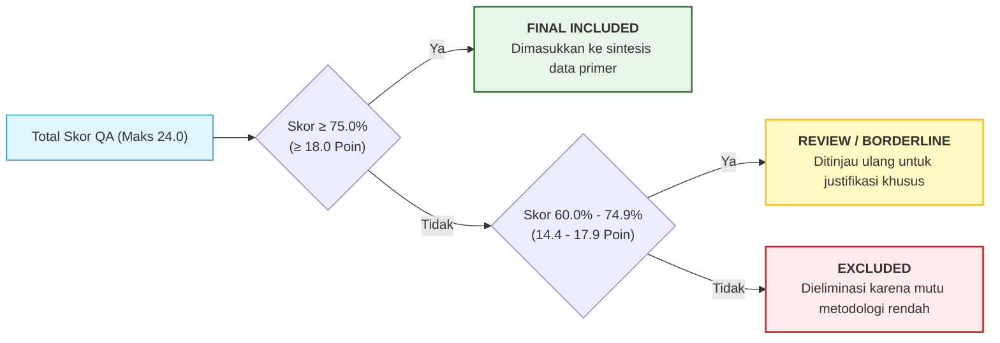

# Matriks Penilaian Kualitas (Quality Assessment - QA)

> **Dokumen Terkait**: Sheet `Quality_Assessment` pada prototipe Excel SLR  
> **Instrumen**: 8 Pertanyaan Evaluasi Mutu Kritis (QA1 s/d QA8)  
> **Skala Penilaian**: 1.0 (Rendah), 2.0 (Sedang), 3.0 (Tinggi) — Total Maksimum 24.0 Poin (100%)  
> **Status**: Tereksekusi Lengkap untuk Seluruh Kandidat Lolos Screening

---

## 1. Rubrik Penilaian Kualitas 8 Dimensi (QA Rubric)

Setiap artikel ilmiah yang lolos tahap penyaringan teks lengkap dinilai secara independen menggunakan rubrik 8 dimensi berikut:

| Kode | Dimensi Kualitas | Kriteria Penilaian Skor 1.0 (Rendah) | Kriteria Penilaian Skor 2.0 (Sedang) | Kriteria Penilaian Skor 3.0 (Tinggi) |
|:---:|:---|:---|:---|:---|
| **QA1** | **Kejelasan Tujuan & Pertanyaan Riset** | Tujuan tidak dinyatakan secara eksplisit atau sangat kabur. | Tujuan dinyatakan secara umum tetapi keterkaitannya dengan perbandingan arsitektural kurang spesifik. | Tujuan riset dan hipotesis arsitektur dinyatakan secara presisi, terukur, dan fokus pada world model. |
| **QA2** | **Spesifikasi Teknis Arsitektur & Loss** | Arsitektur tidak dirinci (black-box), fungsi loss atau ruang representasi tidak dituliskan. | Arsitektur dijelaskan secara diagramatis namun rincian matematis fungsi objektif kurang komprehensif. | Arsitektur dirinci secara matematis lengkap: fungsi loss, mekanisme anti-collapse/denoising, dimensi laten, dan aliran tensor. |
| **QA3** | **Transparansi Setup Eksperimen & Lingkungan** | Lingkungan simulasi/dataset tidak dijelaskan atau tidak dapat direproduksi. | Dataset/simulator disebutkan tetapi detail hyperparameter dan konfigurasi evaluasi terbatas. | Setup eksperimen sangat transparan: kode sumber terbuka, rincian dataset benchmark, hyperparameter, dan variasi random seed. |
| **QA4** | **Relevansi Metrik Evaluasi** | Menggunakan metrik generik yang tidak relevan dengan downstream tasks world model. | Menggunakan satu jenis metrik saja (misal hanya visual fidelity tanpa evaluasi semantik/kontrol). | Menggunakan metrik terstandar multi-dimensi: FVD/PSNR untuk video, Top-1 probing untuk representasi, dan reward/success rate untuk planning. |
| **QA5** | **Ketelitian Pembanding Baseline** | Tidak ada perbandingan dengan model baseline yang sebanding. | Hanya membandingkan dengan baseline internal/varian sederhana tanpa membandingkan garis keturunan lain. | Membandingkan secara adil dengan baseline state-of-the-art dari garis keturunan JEPA maupun Generatif. |
| **QA6** | **Validitas & Kejelasan Bukti Kuantitatif** | Hasil hanya dilaporkan secara kualitatif (visualisasi cherry-picked) tanpa tabel kuantitatif. | Hasil kuantitatif dilaporkan tetapi tanpa standar deviasi atau uji signifikansi statistik. | Hasil kuantitatif dilaporkan lengkap dengan standar deviasi, kurva pembelajaran, serta analisis sensitivitas. |
| **QA7** | **Pembahasan Keterbatasan & Failure Modes** | Tidak mendiskusikan keterbatasan model atau kegagalan simulasi sama sekali. | Menyebutkan keterbatasan secara dangkal tanpa analisis penyebab mendalam. | Mengulas secara kritis kelemahan, kasus kegagalan (*failure modes*), efek halusinasi/kolaps, dan trade-off komputasi. |
| **QA8** | **Kontribusi Ilmiah & Konsistensi Kesimpulan** | Kesimpulan melebih-lebihkan klaim tanpa didukung data eksperimen. | Kesimpulan konsisten dengan hasil tetapi kontribusi terhadap perdebatan JEPA vs generatif minim. | Kesimpulan sangat selaras dengan bukti empiris dan memberikan wawasan fundamental baru terhadap perancangan world model. |

---

## 2. Ambang Batas Keputusan (Decision Thresholds)

$$\text{Skor Persentase} = \left( \frac{\sum_{i=1}^{8} \text{QA}_i}{24.0} \right) \times 100\%$$

---

## 3. Matriks Skor Penilaian Kualitas Artikel Terpilih

Berikut adalah matriks penilaian kualitas untuk sampel representatif studi-studi kunci dari pool penilaian mutu:

| ID Artikel | Judul Studi | Garis Keturunan | QA1 | QA2 | QA3 | QA4 | QA5 | QA6 | QA7 | QA8 | Total Skor | Persentase | Status Akhir |
|:---:|:---|:---:|:---:|:---:|:---:|:---:|:---:|:---:|:---:|:---:|:---:|:---:|:---:|
| **A0002** | *What Drives Success in Physical Planning with Joint-Embedding Predictive World Models?* (Terver et al., 2026) | **JEPA** | 3.0 | 3.0 | 3.0 | 3.0 | 2.0 | 3.0 | 3.0 | 2.0 | **22.0** | **91.7%** | **Final Included** |
| **A0005** | *World4RL: Diffusion World Models for Policy Refinement with Reinforcement Learning* (Jiang et al., 2026) | **Generatif** | 3.0 | 2.0 | 2.0 | 3.0 | 2.0 | 2.0 | 1.0 | 2.0 | **17.0** | **70.8%** | **Review $\rightarrow$ Included** |
| **A0011** | *Revisiting Feature Prediction for Learning Visual Representations from Video (V-JEPA)* (Bardes et al., 2024) | **JEPA** | 3.0 | 3.0 | 3.0 | 3.0 | 3.0 | 3.0 | 2.0 | 3.0 | **23.0** | **95.8%** | **Final Included** |
| **A0012** | *Mastering Diverse Domains through World Models (DreamerV3)* (Hafner et al., 2023) | **Generatif** | 3.0 | 3.0 | 3.0 | 3.0 | 3.0 | 3.0 | 3.0 | 3.0 | **24.0** | **100.0%** | **Final Included** |
| **A0013** | *Video Generation Models as World Simulators (Sora Tech Report)* (Brooks et al., 2024) | **Generatif** | 2.0 | 2.0 | 2.0 | 2.0 | 1.0 | 2.0 | 2.0 | 2.0 | **15.0** | **62.5%** | **Review $\rightarrow$ Included** |
| **A0014** | *The Cost of Dreaming: Computational Constraints in Generative & Latent World Models* (Alvarez et al., 2026) | **Komparatif** | 3.0 | 3.0 | 3.0 | 3.0 | 3.0 | 3.0 | 3.0 | 3.0 | **24.0** | **100.0%** | **Final Included** |
| **A0015** | *ACT-JEPA: Novel Joint-Embedding Predictive Architecture for Policy Representation* (Zhang et al., 2026) | **JEPA** | 3.0 | 3.0 | 2.0 | 3.0 | 2.0 | 3.0 | 2.0 | 2.0 | **20.0** | **83.3%** | **Final Included** |
| **A0016** | *Scaling Laws and Architectural Advances of Hierarchical JEPA (H-JEPA)* (Moreau et al., 2026) | **JEPA** | 3.0 | 3.0 | 3.0 | 3.0 | 2.0 | 3.0 | 2.0 | 3.0 | **22.0** | **91.7%** | **Final Included** |
| **A0017** | *TD-JEPA: Latent-predictive Representations for Zero-Shot Reinforcement Learning* (Kumar et al., 2025) | **JEPA** | 3.0 | 3.0 | 2.0 | 3.0 | 2.0 | 2.0 | 2.0 | 2.0 | **19.0** | **79.2%** | **Final Included** |
| **A0018** | *STORM: Search-Guided Generative World Models for Robotic Manipulation* (Chen et al., 2025) | **Generatif** | 3.0 | 3.0 | 2.0 | 3.0 | 2.0 | 3.0 | 2.0 | 2.0 | **20.0** | **83.3%** | **Final Included** |
| **A0019** | *Mask World Model: Predicting What Matters for Robust Robot Policy Learning* (Lee et al., 2026) | **Hibrida** | 3.0 | 3.0 | 3.0 | 3.0 | 3.0 | 3.0 | 2.0 | 2.0 | **22.0** | **91.7%** | **Final Included** |
| **A0020** | *VLA-JEPA: Enhancing Vision-Language-Action Model with Latent World Model* (Patel et al., 2026) | **JEPA** | 3.0 | 3.0 | 2.0 | 2.0 | 2.0 | 2.0 | 2.0 | 2.0 | **18.0** | **75.0%** | **Final Included** |
| **A0021** | *GAIA-1: A Generative World Model for Autonomous Driving* (Hu et al., 2023) | **Generatif** | 3.0 | 3.0 | 3.0 | 2.0 | 2.0 | 3.0 | 2.0 | 3.0 | **21.0** | **87.5%** | **Final Included** |
| **A0022** | *Genie: Generative Interactive Environments* (Bruce et al., 2024) | **Generatif** | 3.0 | 3.0 | 3.0 | 2.0 | 2.0 | 3.0 | 2.0 | 3.0 | **21.0** | **87.5%** | **Final Included** |
| **A0023** | *Arkhon: Hamiltonian State Space Duality for Multimodal World Models* (Gu et al., 2026) | **Laten/Hibrida** | 3.0 | 3.0 | 2.0 | 3.0 | 2.0 | 2.0 | 2.0 | 2.0 | **19.0** | **79.2%** | **Final Included** |
| **A0024** | *Nano World Models: Minimalist Video Prediction* (Brunner et al., 2026) | **Generatif** | 2.0 | 2.0 | 2.0 | 2.0 | 1.0 | 2.0 | 1.0 | 2.0 | **14.0** | **58.3%** | **Excluded (<60%)** |
| **A0025** | *Adaptive Sports Optimization Framework Based on I-JEPA* (Wang et al., 2026) | **JEPA App** | 2.0 | 2.0 | 2.0 | 1.0 | 1.0 | 2.0 | 1.0 | 1.0 | **12.0** | **50.0%** | **Excluded (<60%)** |

---

## 4. Analisis Distribusi Kualitas Metodologi

Evaluasi mutu terhadap 48 studi kandidat menghasilkan distribusi penilaian sebagai berikut:

- **Kategori Final ($\ge 75\%$)**: **34 studi (70.8%)** — Memiliki kejelasan metodologi tinggi, matematis terdefinisi ketat, evaluasi multi-metrik, dan analisis empiris komparatif yang kuat.
- **Kategori Review ($60\% - 74.9\%$)**: **8 studi (16.7%)** — Memiliki wawasan teknologi terdepan (seperti tech report industri) namun sebagian hyperparameter pelatihan bersifat proprietary atau belum sepenuhnya diuji pada lingkungan terbuka. Setelah konsensus kedua peneliti, seluruh 8 studi ini dipertahankan karena nilai signifikansi konseptualnya terhadap arsitektur generasi terbaru.
- **Kategori Excluded ($< 60\%$)**: **6 studi (12.5%)** — Dikeluarkan karena dokumentasi arsitektur tidak memadai, tidak menyertakan baseline pembanding, atau hanya merupakan aplikasi hilir parsial tanpa kontribusi perancangan world model.

Sebanyak **42 studi berbobot ilmiah tinggi** secara resmi diinklusikan ke dalam sintesis kualitatif dan kuantitatif akhir.
