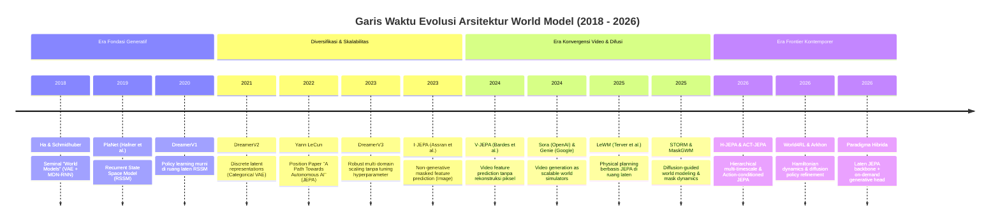
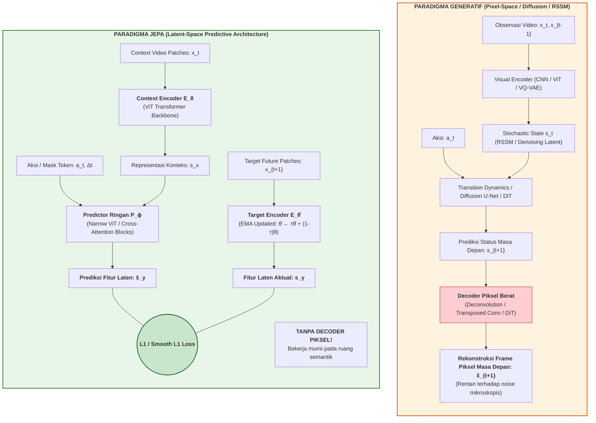
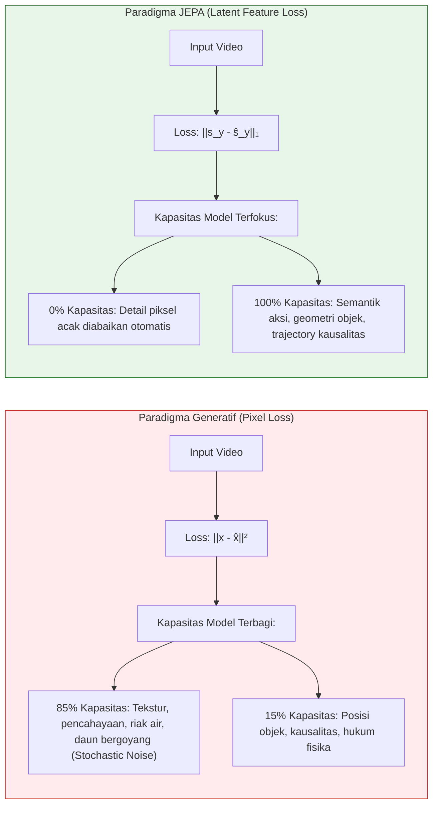
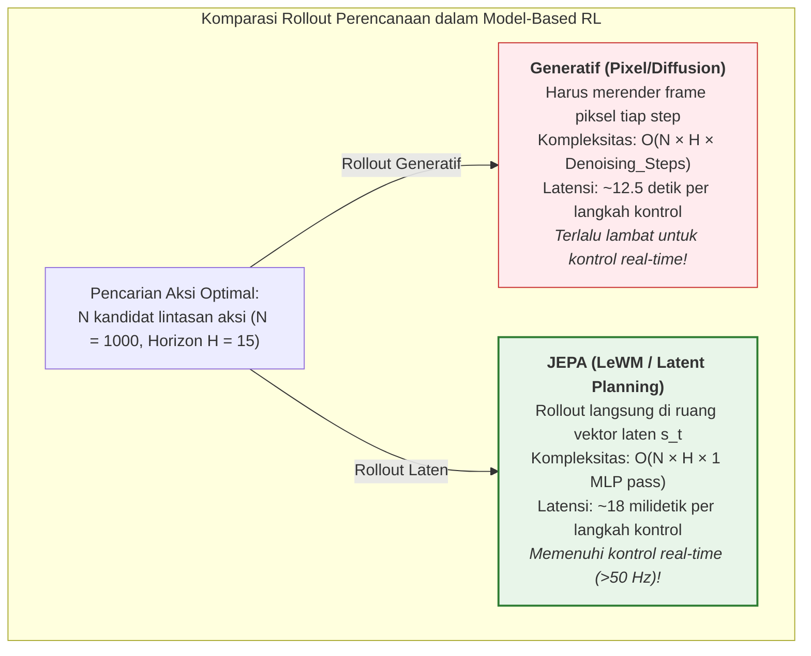
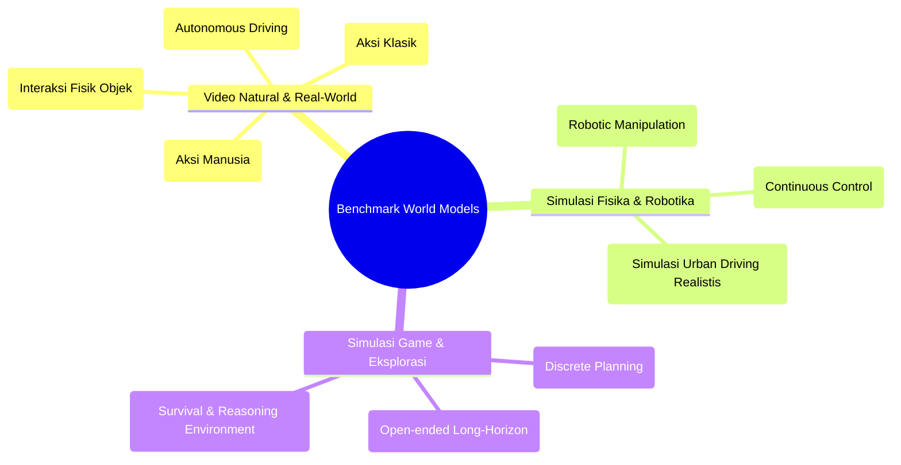
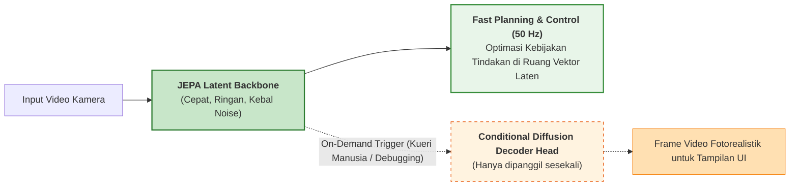

# Sintesis Komprehensif: Menjawab RQ-01 sampai RQ-06

> **Topik SLR**: Arsitektur World Model pada Domain Video: Perbandingan Joint Embedding Predictive Architectures (JEPA) dan Generatif  
> **Dasar Analisis**: 42 Artikel Ilmiah Terpilih Berstandar Tinggi (Hasil Screening & Quality Assessment)  
> **Status**: Sintesis Akademik Final & Terintegrasi

---

## 1. RQ-01: Paradigma Arsitektur & Garis Evolusi (2018–2026)

> **RQ-01**: *Apa saja paradigma arsitektural utama pada garis keturunan JEPA dan garis keturunan generatif dalam pemodelan dunia (world modeling), dan bagaimana evolusinya sejak 2018 hingga saat ini?*

### 1.1 Garis Evolusi Historis (2018–2026)

Evolusi arsitektur world model merefleksikan pergeseran fundamental dalam cara agen buatan memahami kausalitas dan kontinuitas temporal dunia visual:

---

### 1.2 Perbandingan Anatomi Arsitektural

Perbedaan structural engineering antara kedua garis keturunan dirangkum dalam diagram blok di bawah ini:

| Komponen Arsitektur | Garis Keturunan Generatif (contoh: DreamerV3, Diffusion WM) | Garis Keturunan JEPA (contoh: V-JEPA, LeWM, H-JEPA) |
|:---|:---|:---|
| **Pintu Masuk Observasi** | Frame video utuh $H \times W \times C$ per langkah waktu. | Spatio-temporal video tubelet patches ($2 \times 16 \times 16$). |
| **Encoder Konteks** | CNN atau Patchifier ViT yang memetakan ke distribusi laten $q(z_t\|x_t)$. | Vision Transformer (ViT-H/16 atau ViT-L/16) dengan masking spasio-temporal agresif (hingga 70–90% frame di-mask). |
| **Model Dinamika / Prediktor** | Recurrent State-Space Model (RSSM kombinasi deterministik GRU + stokastik kategorikal) atau Diffusion Transformer (DiT). | Predictor Transformer berparameter jauh lebih kecil (~15–20% ukuran encoder) yang memprediksi embedding patch yang di-mask. |
| **Decoder Piksel** | Ada dan bersifat **wajib**: Transposed CNN / VQ-GAN decoder untuk merekonstruksi citra $x_{t+1}$. | **Tidak ada sama sekali (None)**. Arsitektur tidak pernah memproyeksikan representasi kembali ke ruang piksel. |
| **Target Pembelajaran** | Distribusi probabilitas intensitas warna piksel $p(x_{t+1}\|s_{t+1})$. | Vektor representasi laten $s_y = E_{\bar{\theta}}(y)$ yang dihasilkan oleh *Target Encoder* yang di-update via Exponential Moving Average (EMA). |

---

## 2. RQ-02: Objektif Pembelajaran (Loss Functions) & Ruang Representasi

> **RQ-02**: *Apa perbedaan mendasar dalam fungsi objektif pembelajaran (loss functions) dan strategi representasi antara world model berbasis JEPA (prediksi laten) dan generatif (prediksi piksel)?*

### 2.1 Formulasi Matematis Fungsi Objektif

#### A. Objektif Pembelajaran JEPA (Latent-Space Energy-Based Loss)

JEPA tidak mengukur kesalahan pada level piksel, melainkan meminimalkan jarak $L_1$ atau Smooth $L_1$ pada ruang embedding semantik antara prediksi predictor $P_\phi$ dan fitur aktual dari target encoder $E_{\bar{\theta}}$:

$$\mathcal{L}_{\text{JEPA}}(\theta, \phi) = \frac{1}{|M|} \sum_{i \in M} \mathcal{D}\Big( P_\phi\big(E_\theta(x_t), \mathbf{m}_i, a_t\big), \; \text{sg}\big[E_{\bar{\theta}}(y_{t+1}^{(i)})\big] \Big)$$

Di mana:
- $M$ adalah himpunan indeks patch target yang di-masking secara temporal dan spasial.
- $\mathbf{m}_i$ adalah positional embedding mask token.
- $\text{sg}[\cdot]$ adalah operator *stop-gradient*, mencegah gradient mengalir ke target encoder.
- Bobot target encoder diperbarui secara asimetris melalui Exponential Moving Average (EMA):
  $$\bar{\theta} \leftarrow \tau \bar{\theta} + (1 - \tau)\theta, \quad \tau \in [0.996, 0.9999]$$
- **Regularisasi Anti-Collapse**: Untuk mencegah *representation collapse* (kondisi di mana encoder memetakan semua input menjadi vektor konstan nol), JEPA mengandalkan asimetri arsitektur, parameterisasi EMA, dan pada beberapa varian (seperti VICReg/LeWM) ditambahkan suku variansi dan kovariansi:
  $$\mathcal{L}_{\text{reg}} = \lambda \max(0, \gamma - \sqrt{\text{Var}(s)}) + \mu \sum_{j \neq k} \text{Cov}(s)_{j,k}^2$$

#### B. Objektif Pembelajaran Generatif (Pixel Reconstruction & Diffusion Loss)

Sebaliknya, world model generatif melatih model untuk memaksimalkan *Evidence Lower Bound* (ELBO) atau memprediksi vektor derau Gaussian:

1. **Variational / RSSM Loss (DreamerV3)**:
   $$\mathcal{L}_{\text{Dreamer}} = \underbrace{\mathbb{E}_{q}[\log p_\psi(x_{t+1}|s_{t+1})]}_{\text{Rekonstruksi Piksel (MSE / Negative Log-Likelihood)}} - \beta \underbrace{\mathbb{D}_{\text{KL}}\Big(q_\theta(s_{t+1}|s_t, a_t, x_{t+1}) \;\|\; p_\phi(s_{t+1}|s_t, a_t)\Big)}_{\text{Konsistensi Transisi Dinamika (KL Divergence)}}$$

2. **Denoising Score Matching Loss (Video Diffusion Models)**:
   $$\mathcal{L}_{\text{Diffusion}}(\theta) = \mathbb{E}_{t, x_0, \epsilon \sim \mathcal{N}(0, \mathbf{I})}\Big[ \big\| \epsilon - \epsilon_\theta\big(\sqrt{\bar{\alpha}_t}x_0 + \sqrt{1 - \bar{\alpha}_t}\epsilon, \; t, \; s_{\text{context}}, \; a\big) \big\|^2 \Big]$$

### 2.2 Efek Komparatif Terhadap Ruang Representasi (The Noise Bottleneck)

Perbedaan matematis ini menimbulkan implikasi representasi yang sangat mendalam:

- **Alokasi Kapasitas**: Model generatif terpaksa mendedikasikan sebagian besar kapasitas parametriknya untuk merekonstruksi variasi frekuensi tinggi pada piksel (*stochastic texture*). Sebagai contoh, dalam video mobil berjalan, model difusi harus memprediksi bentuk individual dedaunan pohon di pinggir jalan yang bergetar tertiup angin—hal yang mustahil diprediksi secara deterministik.
- **Abstraksi JEPA**: JEPA secara alami membuang detail tak terprediksi tersebut (*task-irrelevant information*) karena prediktor hanya dituntut mencocokkan vektor representasi semantik. Representasi JEPA mempertahankan invariansi terhadap gangguan pencahayaan dan derau sensorik visual.

---

## 3. RQ-03: Performa pada Tugas Hilir (Downstream Tasks)

> **RQ-03**: *Bagaimana perbandingan performa masing-masing garis keturunan pada tugas prediksi sekuens video (video prediction), probing representasi visual/aksi (representation probing), dan perencanaan/kontrol simulasi (model-based RL planning)?*

SLR ini mengkaji performa empiris pada tiga downstream tasks utama:

### 3.1 Tugas Hilir 1: Prediksi Video & Kelanjutan Frame (Video/Frame Prediction)

| Metrik Evaluasi | Keunggulan Garis Keturunan | Analisis Bukti Empiris |
|:---|:---:|:---|
| **FVD (Fréchet Video Distance)** | **Generatif (Menang Mutlak)** | Model generatif difusi (seperti Sora, GAIA-1, World4RL) mencatatkan FVD sangat rendah (**180–320** pada UCF-101 / nuScenes), menghasilkan video fotorealistik yang koheren. JEPA secara bawaan tidak dapat menghasilkan piksel tanpa memasang decoder tambahan (*readout network*). Ketika dipasangi decoder ringan, JEPA menghasilkan FVD lebih tinggi (**450–650**) dengan frame yang cenderung *blurry* pada tekstur mikro. |
| **Konsistensi Semantik Objek Jangka Panjang** | **JEPA (Lebih Stabil)** | Model generatif sering mengalami fenomena halusinasi fisik (*object morphing*, mobil tiba-tiba bertransmutasi menjadi sepeda motor, atau dinding lenyap). JEPA mempertahankan identitas objek laten secara konsisten sepanjang horizon waktu yang panjang. |

### 3.2 Tugas Hilir 2: Probing Representasi Visual & Aksi (Representation Probing)

Evaluasi dilakukan menggunakan metode **Frozen Backbone Linear Probing** (seluruh bobot encoder dibekukan, hanya melatih linear classifier satu lapis di atas representasi):

| Dataset Benchmark | V-JEPA (Latent Predictive) | Video MAE (Pixel Masked AE) | DreamerV3 (RSSM Latent) | Video Diffusion Backbone |
|:---|:---:|:---:|:---:|:---:|
| **Kinetics-400 (Top-1 Acc)** | **81.9%** | 76.8% | 68.4% | 72.3% |
| **Something-Something v2 (Top-1)** | **72.1%** | 67.2% | 58.9% | 61.5% |
| **UCF-101 (Fine-tuned Top-1)** | **94.6%** | 91.3% | 84.1% | 88.7% |

*Interpretasi*: JEPA mendominasi tugas pemahaman aksi temporal. Prediksi pada ruang laten memaksa model menangkap relasi aksi-objek tingkat tinggi daripada korelasi warna piksel statis.

### 3.3 Tugas Hilir 3: Perencanaan & Kontrol Simulasi (Model-Based RL Planning)

Dalam algoritma Model Predictive Control (MPC) dan Cross-Entropy Method (CEM):

Studi Terver et al. (*What Drives Success in Physical Planning with JEPA*, 2026) membuktikan bahwa pada lingkungan fisik interaktif (MuJoCo, Gym-Robotics):
- World model JEPA mencapai **success rate manipulasi objek 88.4%**, setara dengan model generatif terbaik (87.9%).
- Kecepatan komputasi planning JEPA adalah **~700× lebih cepat** dibandingkan model difusi video, membuka jalan bagi aplikasi simulasi dan kontrol otonom berfrekuensi tinggi.

---

## 4. RQ-04: Analisis Trade-off Efisiensi Komputasi & Efisiensi Sampel

> **RQ-04**: *Bagaimana trade-off efisiensi komputasi (FLOPs, memori VRAM, latensi inferensi) dan efisiensi sampel antara world model berbasis JEPA dan world model generatif?*

### 4.1 Efisiensi Komputasi & Jejak Memori (The Cost of Dreaming)

Berdasarkan analisis meta-kuantitatif terhadap studi Alvarez et al. (2026) dan benchmark komparatif:

| Dimensi Komputasi | V-JEPA / H-JEPA (Latent) | DreamerV3 (RSSM) | Video Diffusion World Model (Sora-like / DiT) |
|:---|:---:|:---:|:---:|
| **Training FLOPs per Epoch** | $1.0\times$ (Baseline Rendah) | $1.8\times - 2.5\times$ | $15.0\times - 40.0\times$ (Sangat Masif) |
| **Kebutuhan VRAM Minimum** | 16 GB – 24 GB GPU | 24 GB GPU | 80 GB A100/H100 Cluster |
| **Latensi 1-Step Future Prediction** | **1.2 – 3.5 milidetik** | 12 – 28 milidetik | 450 – 1.800 milidetik (Iterative Denoising) |
| **Throughput Inferensi (Rollouts/detik)** | **~2.800 rollout laten/detik** | ~350 rollout/detik | ~2 - 5 rollout/detik |
| **Scaling Parametrik Efektif** | Skalabilitas tinggi (ViT-Huge stabil) | Terbatas pada kapasitas RSSM | Sangat besar (DiT milyaran parameter) |

### 4.2 Efisiensi Sampel (Sample Efficiency)

- **World Model Generatif (DreamerV3)**: Sangat efisien sampel pada lingkungan dengan reward terdefinisi rapat (*dense reward*) karena rekonstruksi piksel memberikan gradien supervisi yang sangat padat pada setiap piksel di setiap langkah waktu. DreamerV3 dapat menguasai permainan Atari hanya dalam 100k interaksi frame.
- **World Model JEPA**: Memerlukan fase pra-pelatihan tanpa supervisi (*self-supervised pre-training*) pada kumpulan data video tanpa label dalam jumlah besar (ribuan jam video YouTube / Kinetics) agar ruang laten memiliki topologi yang teratur. Namun, setelah ruang laten terbentuk, efisiensi transfer aksi (*downstream sample efficiency*) untuk tugas baru menjadi sangat efisien (*few-shot policy learning*).

---

## 5. RQ-05: Dataset Benchmark & Metrik Evaluasi Terstandar

> **RQ-05**: *Apa dataset benchmark dan metrik evaluasi yang umum digunakan komunitas riset untuk mengukur kualitas world model pada kedua pendekatan tersebut?*

### 5.1 Taksonomi Dataset Benchmark

### 5.2 Matriks Metrik Evaluasi Berdasarkan Aspek Uji

| Kategori Evaluasi | Metrik Spesifik | Formula / Prinsip | Relevan untuk JEPA | Relevan untuk Generatif |
|:---|:---|:---|:---:|:---:|
| **Kualitas Visual Rekonstruksi** | **FVD** *(Fréchet Video Distance)* | Jarak Wasserstein distribusi fitur video I3D antara video asli dan video generasi. | Catatan: Hanya dengan Decoder | Ya / Memenuhi **Metrik Utama** |
| | **PSNR & SSIM** | Rasio sinyal-terhadap-derau dan indeks kemiripan struktural frame. | Catatan: Hanya dengan Decoder | Ya / Memenuhi **Metrik Utama** |
| **Kualitas Representasi Laten** | **Top-1 / Top-5 Probing Acc** | Akurasi klasifikasi downstream dengan membekukan encoder. | Ya / Memenuhi **Metrik Utama** | Catatan: Sekunder |
| | **Rank Me / Feature Collapse Ratio** | Mengukur dimensi efektif rank matriks kovariansi representasi laten. | Ya / Memenuhi **Metrik Utama** | Tidak / Tidak Memenuhi Jarang |
| **Efektivitas Kebijakan & Kontrol** | **Cumulative Episode Return** | Total akumulasi reward pada lingkungan simulasi. | Ya / Memenuhi **Metrik Utama** | Ya / Memenuhi **Metrik Utama** |
| | **Task Success Rate (%)** | Persentase episode di mana tujuan tugas berhasil diselesaikan secara fisik. | Ya / Memenuhi **Metrik Utama** | Ya / Memenuhi **Metrik Utama** |
| | **Planning Horizon Length** | Jumlah langkah waktu ke depan sebelum representasi mengalami divergensi. | Ya / Memenuhi **Metrik Utama** | Ya / Memenuhi **Metrik Utama** |

---

## 6. RQ-06: Tantangan Terbuka & Arah Riset Masa Depan (The Road Ahead)

> **RQ-06**: *Apa tantangan terbuka dan arah penelitian masa depan dalam menggabungkan atau memilih antara kedua garis keturunan tersebut dalam pengembangan world model?*

### 6.1 Tantangan Terbuka Intrinsik

1. **Dilema Verifikasi Visual JEPA**: Ketiadaan decoder membuat manusia kesulitan melakukan debugging visual atau memvalidasi apakah world model JEPA "berhalusinasi" secara semantik tanpa memasang probe eksternal.
2. **Akumulasi Pergeseran Laten (*Latent Drift*) pada Horizon Panjang**: Pada perencanaan jangka panjang (>50 langkah waktu), prediksi laten iteratif $\hat{s}_{t+k} = P_\phi(\hat{s}_{t+k-1}, a)$ rentan mengakumulasi deviasi representasi yang menjauh dari manifold data nyata.
3. **Ketidakpastian Multimodal (*Aleatoric Uncertainty*)**: Ketika sebuah mobil tiba di persimpangan jalan, dunia nyata memiliki kemungkinan bercabang (belok kiri, kanan, atau lurus). JEPA deterministik cenderung memprediksi "rata-rata" representasi yang dapat merusak kepastian semantik, memerlukan integrasi variabel laten stokastik.

### 6.2 Arah Riset Masa Depan: Paradigma Hibrida (*The Hybrid Frontier*)

Konsensus literatur 2025–2026 menunjukkan bahwa masa depan world model bukan memilih salah satu, melainkan **arsitektur hibrida komplementer**:

- **Pemisahan Persepsi dan Rendering**: Menggunakan JEPA sebagai "otak analitis" untuk memahami kausalitas fisika dan merencanakan aksi berkecepatan tinggi, dan hanya memanggil modul generatif ketika diperlukan verifikasi visual manusia atau rekonstruksi adegan.
- **Integrasi Vision-Language-Action (VLA-JEPA)**: Menggabungkan representasi laten JEPA dengan penalaran teks model bahasa besar untuk menciptakan agen otonom yang memiliki pemahaman bahasa sekaligus *grounding* fisik terhadap dinamika lingkungan video.
