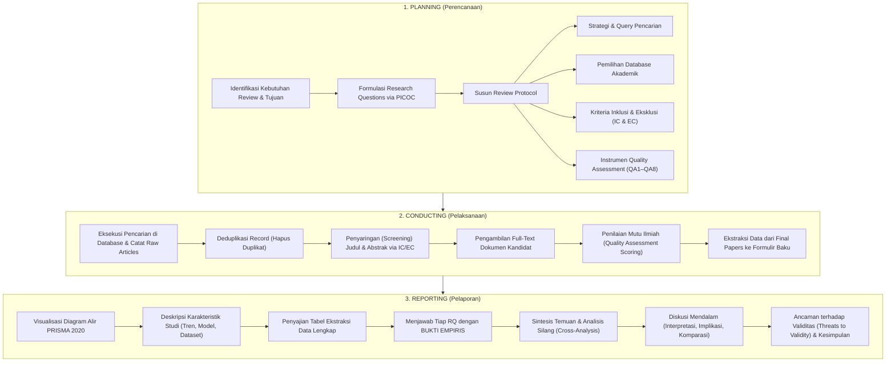

# SYSTEM MEMORY & KNOWLEDGE BASE: SLR FRAMEWORK DOSEN
**Mata Kuliah:** Penulisan Ilmiah (Scientific Writing) — Persiapan Proposal Tugas Akhir (TA)  
**Dosen Pengampu:** Rizka Wakhidatus Sholikah  
**Target AI Agent:** Gemini 3.8 Flash / Antigravity Agent Context Anchor  
**Status Dokumen:** Master Reference & System Memory (Wajib Diingat dan Dipatuhi)

---

## 1. Metadata & Rangkuman Dokumen Sumber

Dokumen ini merupakan intisari menyeluruh dari **4 materi resmi dosen**:
1. `SLR Framework.pdf` — Slide materi pengantar SLR, komparasi review, Kitchenham 3 proses (Planning, Conducting, Reporting), PICOC, dan PRISMA 2020.
2. `PRISMA_2020_flow_diagram_new_SRs_v1.docx` — Template diagram alir PRISMA 2020 resmi untuk pencarian via **Databases & Registers Only**.
3. `PRISMA_2020_flow_diagram_new_SRs_v2 (1).docx` — Template diagram alir PRISMA 2020 resmi untuk pencarian via **Databases, Registers, AND Other Sources** (Websites, organisations, citation searching/snowballing).
4. `Kitchenham_SLR_Article_Selection_Template.xlsx` — Workbook operasional seleksi artikel 9 sheet standar Kitchenham & Charters (2007) dengan formula screening, QA scoring, dan kalkulasi PRISMA otomatis.

---

## 2. Fondasi Konseptual: Apa itu SLR?

### 2.1 Definisi SLR
**Systematic Literature Review (SLR)** adalah metodologi penelitian formal untuk **mengumpulkan, mengidentifikasi, dan menganalisis secara kritis** seluruh bukti empiris yang relevan terhadap pertanyaan penelitian tertentu melalui **prosedur terstandar, eksplisit, dan dapat direproduksi (*reproducible*)** (Pati & Lorusso, 2018; Kitchenham, 2007).

**Tujuan Utama SLR:**
1. Mengidentifikasi celah riset (*research gaps*).
2. Memberikan bukti empiris (*evidence*) yang terstruktur untuk menjawab pertanyaan penelitian.
3. Menjadi fondasi ilmiah yang kokoh bagi perumusan novelty dan metodologi pada **Proposal Tugas Akhir (TA)**.

### 2.2 Komparasi Tipe Artikel Review

| Dimensi | Systematic Literature Review (SLR) | Meta-Analysis | Scoping Review | Traditional / Narrative Review |
|:---|:---|:---|:---|:---|
| **Tujuan Utama** | Menjawab research question spesifik secara terstruktur & berbasis bukti | Mengukur besaran efek (*effect size*) secara statistik kuantitatif | Memetakan lanskap riset, konsep utama, dan batas-batas topik | Memberikan gambaran umum (*broad overview*) suatu topik |
| **Protokol** | Mengikuti protokol ketat terdefinisi di awal (Kitchenham / PRISMA) | Protokol kuantitatif sangat ketat | Protokol fleksibel (misal Arksey & O'Malley) | **Tidak ada** protokol formal |
| **Strategi Pencarian** | Eksplisit, terdokumentasi, reproducible | Eksplisit, mencari data numerik | Eksplisit, jangkauan luas | Informal, selektif, sering tidak didokumentasikan |
| **Tipe Data** | Kualitatif + Kuantitatif | **Kuantitatif murni** | Mayoritas kualitatif | Kualitatif / Opini |
| **Kedalaman (*Depth*)** | **Tinggi** | **Sangat Tinggi (Statistik)** | Sedang | Rendah – Sedang |
| **Keluasan (*Breadth*)** | Sedang – Terfokus | Rendah – Spesifik | **Tinggi** | Luas tidak terstruktur |
| **Output** | Sintesis terstruktur & jawaban RQ | Estimasi statistik gabungan (forest plot, CI) | Pemetaan tematik (*thematic mapping*) | Narasi deskriptif subjektif |
| **Sifat** | Transparan, objektif, minim bias | Kuantitatif matematis | Eksploratif | Subjektif, rawan bias pemilihan |

---

## 3. Metodologi Kitchenham (3 Tahapan Utama)

Panduan utama yang diajarkan dosen mengacu pada **Barbara Kitchenham & Charters (2007)** yang dirancang khusus untuk bidang **Rekayasa Perangkat Lunak (Software Engineering) dan Komputasi Kompleks**.

---

## 4. Bedah Detail Fase 1: PLANNING (Perencanaan)

### 4.1 Kerangka PICOC
PICOC digunakan untuk mendekomposisi topik penelitian menjadi komponen terukur dan memformulasikan kata kunci pencarian serta Research Questions (RQs).

| Elemen | Arti | Pertanyaan Pemandu | Contoh Dosen (AES) | Contoh Tugas Akhir User (World Model) |
|:---|:---|:---|:---|:---|
| **P – Population** | Populasi / Objek yang diteliti | Siapa/apa entitas atau sistem yang dipelajari? | *Student essays / written responses* | Sistem AI dengan *world model* untuk prediksi video/lingkungan |
| **I – Intervention** | Metode / Teknologi yang diuji | Teknologi, algoritma, atau pendekatan spesifik apa yang diterapkan? | *Transformer-based models (BERT, RoBERTa, GPT)* | Arsitektur representasi laten non-generatif (**JEPA**) |
| **C – Comparison** | Pembanding (Opsional) | Apa pendekatan pembanding, baseline, atau alternatifnya? | *Traditional ML (SVM), RNN/LSTM, human scoring* | Arsitektur *world model* **generatif** (Difusi, Autoregressive, VAE) |
| **O – Outcomes** | Hasil / Luaran terukur | Efek, metrik performa, atau dampak apa yang dievaluasi? | *Accuracy, QWK (Quadratic Weighted Kappa), fairness* | Efisiensi FLOPs/VRAM, FVD, Probing Accuracy, Planning Reward |
| **C – Context** | Lingkungan / Domain | Di lingkungan atau kondisi apa studi dilakukan? | *Educational datasets (ASAP, TOEFL), e-learning* | Domain video (Kinetics, SSv2) & simulator kontrol (MuJoCo, CARLA) |

### 4.2 Formulasi Research Questions (RQs)
Setiap RQ diturunkan dari kombinasi elemen PICOC.
- **Aturan Dosen:** 1 Sub-bab Laporan hanya menjawab 1 RQ secara spesifik.
- **Contoh Pola RQ:**
  - *RQ1 (Intervention)*: Model/metode apa saja yang digunakan pada domain X?
  - *RQ2 (Intervention + Outcome)*: Bagaimana performa/akurasi dari metode tersebut?
  - *RQ3 (Intervention + Comparison)*: Bagaimana perbandingan performa metode I terhadap pembanding C?
  - *RQ4 (Outcome + Context)*: Apa saja dataset benchmark dan metrik yang digunakan?
  - *RQ5 (Synthesis + Future Direction)*: Apa saja trade-off arsitektural dan tantangan terbuka untuk riset mendatang?

### 4.3 Strategi Pencarian & Aturan Database

#### Logika Konstruksi Boolean
- **Dalam 1 konsep (sinonim/variasi):** Gunakan operator `OR`  
  Contoh: `("automated essay scoring" OR "essay scoring" OR "AES")`
- **Antar konsep utama:** Gabungkan dengan operator `AND`  
  Contoh: `(Konsep P) AND (Konsep I) AND (Konsep C/O)`

#### Aturan Sumber Database Akademik
- **Direkomendasikan (Database Primer/Utama):**
  - ✅ **Scopus**
  - ✅ **IEEE Xplore**
  - ✅ **ACM Digital Library**
  - ✅ **ScienceDirect (Elsevier)**
  - ✅ **SpringerLink / Nature**
- **Aturan Google Scholar:**
  - ❌ **DILARANG dijadikan sumber database primer utama** karena tidak terindeks ketat, banyak noise, dan duplikasi tidak terkontrol.
  - ⚠️ Hanya boleh digunakan sebagai sumber sekunder untuk *citation searching / backward-forward snowballing*.

### 4.4 Kriteria Inklusi & Eksklusi (Inclusion & Exclusion Criteria)
> **ATURAN MUTLAK DOSEN:** Kriteria inklusi dan eksklusi **HARUS DITETAPKAN SEBELUM PENCARIAN DILAKUKAN** (pada fase Planning), bukan diubah-ubah di tengah jalan. Hal ini bertujuan untuk:
> 1. Mencegah bias subjektif peneliti (*prevent bias*).
> 2. Menjamin konsistensi penyaringan (*ensure consistency*).
> 3. Memastikan proses dapat direproduksi oleh peneliti lain (*ensure reproducibility*).

#### Template Standar Kriteria (dari Template Excel Dosen):
- **Inclusion Criteria (IC):**
  - `IC1`: Artikel secara langsung menjawab topik/Research Question review.
  - `IC2`: Sesuai dengan populasi, teknologi intervensi, konteks yang didefinisikan.
  - `IC3`: Diterbitkan dalam rentang tahun yang ditentukan (misal 2018–2026).
  - `IC4`: Merupakan jenis publikasi peer-reviewed (Jurnal / Prosiding Konferensi bereputasi).
  - `IC5`: Teks lengkap (*full text*) tersedia dan dapat diakses.
- **Exclusion Criteria (EC):**
  - `EC1`: Catatan duplikat (*duplicate record*).
  - `EC2`: Diterbitkan di luar batas waktu yang ditentukan.
  - `EC3`: Topik salah / tidak menjawab research question.
  - `EC4`: Populasi, konteks, atau teknologi intervensi tidak sesuai.
  - `EC5`: Jenis publikasi tidak memenuhi syarat (bukan peer-reviewed, artikel opini, non-English, short paper/poster).
  - `EC6`: Full text tidak dapat diakses / tidak tersedia.

### 4.5 Penilaian Mutu (Quality Assessment / QA)
Instrumen QA digunakan untuk menyaring artikel kandidat agar hanya riset berkualitas tinggi yang masuk ke tahap ekstraksi dan sintesis akhir.
- **Jumlah Pertanyaan:** Idealnya **5–10 pertanyaan** (template dosen menyediakan **8 pertanyaan QA1–QA8**).
- **Skala Penilaian Baku:** Skala 1–3
  - `1` = Kualitas Rendah / Tidak Memenuhi (*Low / No / Insufficient*)
  - `2` = Kualitas Sedang / Sebagian (*Moderate / Partly / Partially Met*)
  - `3` = Kualitas Tinggi / Sangat Jelas (*High / Yes / Fully Met*)
- **Total Skor Maksimum (8 QA):** $8 \times 3 = 24$ poin.
- **Persentase Mutu:** $\text{QA Percentage} = \frac{\text{Skor Didapat}}{24} \times 100\%$
- **Ambang Batas Keputusan (*Threshold* Default Dosen):**
  - $\ge 75\%$ (Skor $\ge 18$) $\rightarrow$ **FINAL** (Lolos ke ekstraksi akhir).
  - $60\% - 74.9\%$ (Skor $14.4 - 17.9$) $\rightarrow$ **REVIEW** (Didiskusikan antar peneliti/konsensus).
  - $< 60\%$ (Skor $< 14.4$) $\rightarrow$ **EXCLUDE** (Dieliminasi dari sintesis akhir).

#### 8 Pertanyaan QA Standar Dosen:
1. `QA1`: Apakah tujuan penelitian dan research questions dinyatakan secara jelas?
2. `QA2`: Apakah konteks studi, dataset, sampel, atau lingkungan eksperimental dideskripsikan secara memadai?
3. `QA3`: Apakah metode penelitian yang digunakan sesuai untuk mencapai tujuan yang dinyatakan?
4. `QA4`: Apakah prosedur pengumpulan data dijelaskan secara transparan dan memadai?
5. `QA5`: Apakah prosedur analisis data / evaluasi eksperimental tepat dan diuraikan dengan cukup detail?
6. `QA6`: Apakah hasil penelitian dilaporkan secara jelas dan didukung oleh bukti empiris yang kuat?
7. `QA7`: Apakah ancaman terhadap validitas (*threats to validity*), keterbatasan (*limitations*), atau potensi bias didiskusikan?
8. `QA8`: Apakah kesimpulan yang ditarik konsisten dan didukung penuh oleh hasil eksperimen yang dilaporkan?

---

## 5. Bedah Detail Workbook Excel: `Kitchenham_SLR_Article_Selection_Template.xlsx`

Struktur workbook ini terdiri dari 9 sheet yang saling terintegrasi secara fungsional:

### 5.1 Sheet 1: `README`
Berisi petunjuk alur kerja: `Raw Article Data` $\rightarrow$ `Inclusion/Exclusion Screening` $\rightarrow$ `Candidate Papers` $\rightarrow$ `Quality Assessment` $\rightarrow$ `Final Papers`. Menjelaskan skala QA 1–3, batas 75%/60%, dan anjuran piloting kriteria.

### 5.2 Sheet 2: `PICOC_RQs`
Tabel pendefinisian P, I, C, O, C dan pemetaan tiap RQ ke elemen PICOC penyusunnya.

### 5.3 Sheet 3: `Search_Strategy`
Log pencarian mendokumentasikan:
- Tujuan pencarian, periode, tanggal eksekusi.
- Tabel Database Search Log: Kolom Platform/URL, Search Date, Exact Search String, Filters/Limits, Results Returned ($N$), dan Catatan.
- Tabel Konstruksi String Pencarian: Pemecahan konsep, sinonim, dan blok akhir boolean.

### 5.4 Sheet 4: `Protocol_Criteria`
Dokumentasi kriteria review sebelum screening dimulai:
- Definisi IC1 s/d IC5 dan EC1 s/d EC6.
- Definisi instrumen QA1 s/d QA8 beserta threshold kelulusan.

### 5.5 Sheet 5: `Raw_Articles`
Menampung seluruh record mentah hasil query database.
- **Kolom A–Q:** `Article_ID`, `Source_Type` (Database / Register / Snowball-Backward / Snowball-Forward / Other), `Database/Source`, `Search_Date`, `Search_Query`, `Title`, `Authors`, `Year`, `Journal/Conference`, `DOI`, `URL`, `Abstract`, `Document_Type`, `Language`, `Duplicate_Key`, `Duplicate?` (Yes/No), `Notes`.

### 5.6 Sheet 6: `Screening`
Penyaringan tahap 1 (Judul & Abstrak) dan tahap 2 (Full-text).
- **Kolom A–R:** `Article_ID`, `Title`, `IC1` s/d `IC5`, `EC1` s/d `EC6`, `Inclusion_Score`, `Exclusion_Flag`, `Screening_Decision`, `Exclusion_Reason`, `Screening_Notes`.
- **Formula Otomatis Excel:**
  - `Title` (B2): `=IFERROR(INDEX(Raw_Articles!$F:$F,MATCH(A2,Raw_Articles!$A:$A,0)),"")`
  - `Inclusion_Score` (N2): `=IF(COUNTA(C2:G2)=0,"",COUNTIF(C2:G2,"Yes"))`
  - `Exclusion_Flag` (O2): `=IF(COUNTA(H2:M2)=0,"",IF(COUNTIF(H2:M2,"Yes")>0,"YES","NO"))`
  - `Screening_Decision` (P2): `=IF(A2="","",IF(O2="YES","Exclude",IF(N2=5,"Candidate","Review")))`
  - **Artinya:** Artikel lolos menjadi **Candidate** jika dan hanya jika **seluruh 5 IC bernilai "Yes" ($N_2=5$)** DAN **tidak ada satu pun kriteria EC yang bernilai "Yes" ($O_2=\text{"NO"}$)**. Jika ada 1 saja EC yang "Yes", otomatis **Exclude**.

### 5.7 Sheet 7: `Quality_Assessment`
Evaluasi kualitas untuk seluruh paper berstatus **Candidate**.
- **Kolom A–O:** `Article_ID`, `Title`, `QA1` s/d `QA8`, `QA_Total`, `Max_Score`, `QA_Percentage`, `Quality_Decision`, `QA_Notes`.
- **Formula Otomatis Excel:**
  - `Title` (B2): `=IFERROR(INDEX(Screening!$B:$B,MATCH(A2,Screening!$A:$A,0)),"")`
  - `QA_Total` (K2): `=IF(COUNTA(C2:J2)=0,"",SUM(C2:J2))`
  - `Max_Score` (L2): `=IF(COUNTA(C2:J2)=0,"",8*3)`
  - `QA_Percentage` (M2): `=IF(K2="","",K2/L2)`
  - `Quality_Decision` (N2): `=IF(M2="","",IF(M2>=75%,"Final",IF(M2>=60%,"Review","Exclude")))`

### 5.8 Sheet 8: `Final_Papers`
Tabel ekstraksi data lengkap untuk seluruh artikel yang lolos QA (Status "Final" atau "Review" yang disetujui).
- **Kolom A–R:** `Article_ID`, `Title`, `Authors`, `Year`, `Journal/Conference`, `DOI`, `URL`, `Research_Aim`, `Research_Question`, `Methodology`, `Dataset/Sample`, `Technology/Approach`, `Evaluation_Metrics`, `Key_Findings`, `Limitations`, `Future_Work`, `Relevant_RQ`, `Extraction_Notes`.
- **Formula Otomatis:** Mengambil otomatis atribut bibliografi (`Title`, `Authors`, `Year`, `Journal`, `DOI`, `URL`) dari sheet `Raw_Articles` menggunakan fungsi `INDEX/MATCH`.

### 5.9 Sheet 9: `PRISMA_Counts`
Sheet agregasi otomatis yang menghitung metrik untuk mengisi diagram alir PRISMA 2020:
- `B5`: `=COUNTIF(Raw_Articles!B:B,"Database")+COUNTIF(Raw_Articles!B:B,"Register")` $\rightarrow$ Total identifikasi database.
- `B6`: `=COUNTIF(Raw_Articles!B:B,"Snowball-Backward")+COUNTIF(Raw_Articles!B:B,"Snowball-Forward")+COUNTIF(Raw_Articles!B:B,"Other")` $\rightarrow$ Total identifikasi metode lain.
- `B7`: `=COUNTIF(Raw_Articles!P:P,"Yes")` $\rightarrow$ Total duplikat yang dihapus.
- `B8`: `=COUNTIF(Screening!P:P,"Candidate")+COUNTIF(Screening!P:P,"Exclude")+COUNTIF(Screening!P:P,"Review")` $\rightarrow$ Total artikel yang diskrining.
- `B9`: `=COUNTIF(Screening!P:P,"Candidate")` $\rightarrow$ Total kandidat lolos ke full-text / QA.
- `B10`: `=COUNTIF(Quality_Assessment!N:N,"Final")+COUNTIF(Quality_Assessment!N:N,"Exclude")` $\rightarrow$ Total artikel yang dinilai QA.
- `B11`: `=COUNTIF(Quality_Assessment!N:N,"Final")` $\rightarrow$ Total artikel final yang masuk sintesis SLR.
- `B12`: `=COUNTIF(Quality_Assessment!N:N,"Exclude")` $\rightarrow$ Total artikel yang digugurkan pada tahap QA.

---

## 6. Standar PRISMA 2020: Perbedaan v1 vs v2

PRISMA 2020 (*Preferred Reporting Items for Systematic Reviews and Meta-Analyses*) memuat **27 checklist** pelaporan. Pada materi dosen, dilampirkan 2 varian resmi diagram alir:

### 6.1 PRISMA 2020 v1: `PRISMA_2020_flow_diagram_new_SRs_v1.docx`
- **Kondisi Penggunaan:** Digunakan jika pencarian literatur **HANYA BERSUMBER DARI BASIS DATA & REGISTER RESMI** (*Databases and Registers Only*).
- **Alur 4 Tingkat Tunggal:**
  1. **Identification**:
     - *Records identified from*: Databases ($n=\dots$), Registers ($n=\dots$).
     - *Records removed before screening*: Duplicate records removed ($n=\dots$), Records marked as ineligible by automation tools ($n=\dots$), Records removed for other reasons ($n=\dots$).
  2. **Screening**:
     - *Records screened* ($n=\dots$) $\rightarrow$ *Records excluded* ($n=\dots$, rincikan human vs automation).
     - *Reports sought for retrieval* ($n=\dots$) $\rightarrow$ *Reports not retrieved* ($n=\dots$).
  3. **Eligibility**:
     - *Reports assessed for eligibility* ($n=\dots$) $\rightarrow$ *Reports excluded* dengan rincian alasan jelas: Reason 1 ($n=\dots$), Reason 2 ($n=\dots$), dst.
  4. **Included**:
     - *Studies included in review* ($n=\dots$) dan *Reports of included studies* ($n=\dots$).

### 6.2 PRISMA 2020 v2: `PRISMA_2020_flow_diagram_new_SRs_v2 (1).docx`
- **Kondisi Penggunaan:** Digunakan jika tinjauan sistematis menggunakan **SUMBER GABUNGAN**: Basis data akademik **PLUS** metode identifikasi lain (*Other Methods*) seperti:
  - Pencarian situs web (*Websites*)
  - Organisasi / Grey literature (*Organisations*)
  - Pencarian sitasi (*Citation searching / Backward & Forward Snowballing*)
- **Struktur Diagram Dua Jalur Berdampingan:**
  - **Jalur Kiri:** Alur standar identifikasi via Database & Register (sama seperti v1).
  - **Jalur Kanan:** Alur paralel identifikasi via metode lain:
    - *Records identified from*: Websites ($n=\dots$), Organisations ($n=\dots$), Citation searching ($n=\dots$).
    - *Reports sought for retrieval* ($n=\dots$) $\rightarrow$ *Reports not retrieved* ($n=\dots$).
    - *Reports assessed for eligibility* ($n=\dots$) $\rightarrow$ *Reports excluded with reasons* ($n=\dots$).
  - **Titik Temu (*Convergence*) pada Tahap Included:**
    - Kotak akhir menyatukan total studi dari jalur database + jalur metode lain ke dalam: *Studies included in review* ($n=\dots$).

---

## 7. Prinsip Emas Penulisan Laporan (Reporting) & Pantangan

### 7.1 Aturan Menjawab Research Questions (RQs)
1. **Wajib Berbasis Bukti Nyata (*Evidence-Based*):**
   - ❌ *DILARANG KERAS membuat klaim subjektif/abstrak:*  
     *"Model BERT sangat populer dan sering digunakan oleh para peneliti."* (SALAH – terlalu abstrak dan subjektif).
   - ✅ *WAJIB gunakan fakta data kuantitatif/empiris:*  
     *"Model berbasis BERT digunakan pada 70% studi yang ditinjau (28 dari 40 artikel), dengan rincian 15 studi menggunakan RoBERTa dan 13 studi menggunakan BERT-base standar."* (BENAR – spesifik dan terbukti).
2. **Aturan Struktur 1 RQ = 1 Sub-bab:**
   - Jangan pernah mencampuradukkan pembahasan antar RQ dalam satu paragraf acak. Buat sub-bab terpisah:
     - `4.1 Jawaban RQ-01: ...`
     - `4.2 Jawaban RQ-02: ...`
     - `4.3 Jawaban RQ-03: ...`
3. **Pemisahan Kedalaman Analisis:**
   - Pada bagian **Hasil Jawaban RQ**: Berikan data faktual, tabel/grafik visual pendukung, dan **interpretasi singkat**.
   - Pada bagian **Discussion**: Lakukan **interpretasi mendalam**, jelaskan *alasan ilmiah mengapa hasilnya demikian*, bandingkan dengan riset terdahulu, paparkan kontradiksi, dan bahas implikasi teknis.
4. **Sintesis Temuan (*Cross-Analysis*):**
   - Lakukan analisis silang multi-dimensi (contoh: menghubungkan *Arsitektur Model* $\times$ *Metrik Efisiensi Komputasi* $\times$ *Karakteristik Dataset*).

---

## 8. Panduan Khusus AI Agent: Cara Berperilaku Setiap Kali Menjawab Prompt

Sebagai AI Agent pendamping penulisan ilmiah, terapkan aturan operasional berikut:
1. **Selalu ingat kerangka Kitchenham 3 proses** (Planning, Conducting, Reporting).
2. **Jangan halusinasi metrik**: Jika membahas jumlah paper atau statistik, selalu rujuk data nyata dari file project (`01` s/d `06` dan `README.md`).
3. **Tegakkan kriteria inklusi/eksklusi**: Setiap analisis seleksi paper harus beralasan kode `IC` atau `EC` yang jelas.
4. **Gunakan standar QA 1–3**: Evaluasi paper harus berbasis 8 dimensi kualitas dengan ambang batas $\ge 75\%$ (Final), $60-74.9\%$ (Review), dan $<60\%$ (Exclude).
5. **Gaya bahasa ilmiah akademik baku**: Formal, objektif, terstruktur, berbasis data, tanpa kalimat berbunga-bunga (*puffery*).
